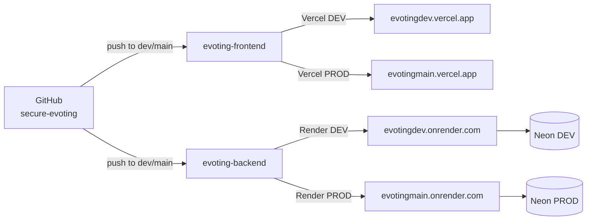
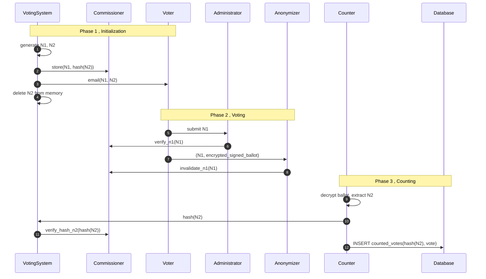

CryptoVote is a full-stack secure electronic voting system built at ENSTA Alger for the Applied Cryptography module. The backend is a FastAPI monolith split into five logical services. The frontend is a standalone React/Next.js application. The two communicate over HTTPS. Services inside the backend communicate via direct Python function calls never HTTP between them.

---

## Repository Structure

The project lives under the GitHub organization **`secure-evoting`**, with two repositories.

| Repository | Stack | Hosting |
|---|---|---|
| `evoting-backend` | FastAPI · Python 3.11 | Render |
| `evoting-frontend` | React · Next.js · TailwindCSS | Vercel |

<Note>
A GitHub organization is used instead of personal repositories to enforce shared ownership, centralized branch protection, and scoped team permissions.
</Note>

---

## Infrastructure Map

Full details on each platform are covered in the [Infrastructure](/infra/overview) section.

---

## The Five Logical Services

All business logic is split across five services inside the single FastAPI application. Each service has a strictly scoped responsibility and a defined boundary of what it can know.

| Service | Knows | Cannot Know |
|---|---|---|
| **VotingSystem** | Voter emails, N1, N2 (in memory during init only) | Vote content, how N2 was used |
| **Commissioner** | Valid N1 codes, hash(N2) fingerprints | N2 in plaintext, vote content |
| **Administrator** | N1 validity (via Commissioner) | N2, actual vote content |
| **Anonymizer** | N1 (to invalidate), encrypted votes | N2, decrypted vote content |
| **Counter** | Decrypted votes, N2 (during counting only) | Voter identity, N1 |

<Warning>
Services communicate via direct Python function calls only. No service calls another over HTTP. Any inter-service HTTP call is a protocol violation.
</Warning>

No single entity holds enough information to compromise the election unilaterally. Breaking any single guarantee requires collusion between at least two entities.

---

## The Three Election Phases

### 1. Initialization

VotingSystem generates an N1 and N2 pair per voter, hashes N2 with SHA-256, and sends `hash(N2)` to the Commissioner. N2 is emailed to the voter and immediately deleted from memory , it is never written to any database.

### 2. Voting

The voter blinds their ballot and requests a signature from the Administrator, which signs without seeing the vote content. The voter unblinds the signature, encrypts the ballot with the Counter's public key, and submits it to the Anonymizer alongside N1. The Anonymizer atomically invalidates N1 and stores the encrypted ballot with no identity link.

### 3. Counting

The Counter decrypts all ballots, verifies each Administrator signature, extracts N2, and passes it to VotingSystem for hashing. Valid votes are inserted into `counted_votes` with a UNIQUE constraint on `hash(N2)` , enforcing no double counting at the database level.

Full protocol details and pseudocode are in [Cryptographic Protocol](/crypto/protocol).

---

## N1 / N2 Lifecycle

<Warning>
N2 is never stored in plaintext anywhere. The only persisted form is its SHA-256 hash, held in `credentials` and `counted_votes`.
</Warning>

---

## Continue Reading

<CardGroup cols={2}>
  <Card title="Security Model" icon="shield" href="/security-model">
    Anonymity guarantees, attack prevention, and the full security table.
  </Card>
  <Card title="Cryptographic Protocol" icon="key" href="/crypto/protocol">
    Blind signature workflow and full vote lifecycle pseudocode.
  </Card>
  <Card title="Infrastructure" icon="server" href="/infra/overview">
    Deployment platforms, environments, and CI/CD pipeline.
  </Card>
  <Card title="Database Schema" icon="database" href="/database/schema">
    Table structure, constraints, and migration rules.
  </Card>
</CardGroup>