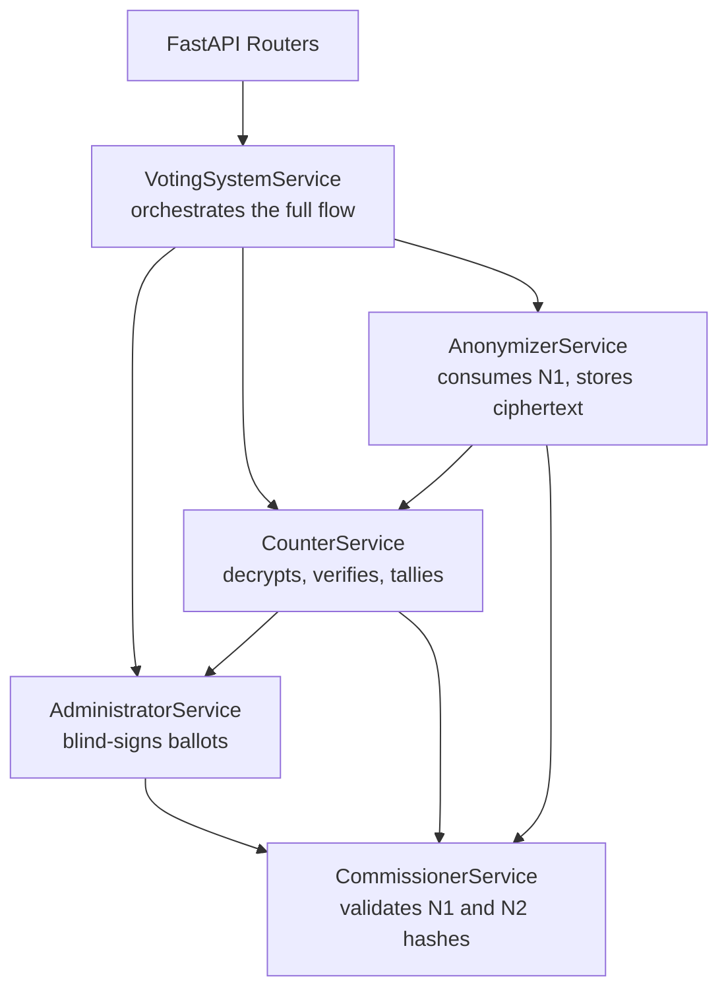

The backend implements a five-party cryptographic voting protocol as a set of layered services. Each service maps to one actor in the protocol and knows only what that actor is supposed to know. The information boundaries between them are not just good software design — they are the mechanism that makes the protocol secure.

## Service dependency graph



All five services are wired together via FastAPI's dependency injection system in `app/dependencies.py`. The router only ever calls `VotingSystemService` directly — everything else is orchestrated internally.

## Directory layout

```
app/
├── main.py               # FastAPI app, router registration, CORS, SessionMiddleware
├── config.py             # env var loading via pydantic-settings
├── database.py           # SQLAlchemy engine, session factory
├── dependencies.py       # get_db, service instantiation
│
├── models/               # SQLAlchemy ORM models
├── schemas/              # Pydantic request + response shapes
├── routers/              # thin HTTP handlers, no business logic
├── services/             # five protocol actor implementations
├── repositories/         # all DB reads and writes
└── utils/
    └── crypto.py         # RSA, blind signatures, ballot operations
```

## Layer responsibilities

**Routers** parse the HTTP request, validate input with Pydantic, call one service method, and return the response. They contain no business logic and no direct database access.

**Services** implement the protocol. They coordinate between repositories and crypto utilities. This is where the security-sensitive decisions happen.

**Repositories** are the only layer that talks to the database. Each repository owns one ORM model. No raw SQL outside of repositories.

**Models** define the schema in SQLAlchemy declarative style. Schema changes always go through an Alembic migration.

**Utils** are stateless helpers. `crypto.py` implements RSA key generation, ballot blinding, signing, unblinding, encryption, and verification. It has no side effects and no database access.