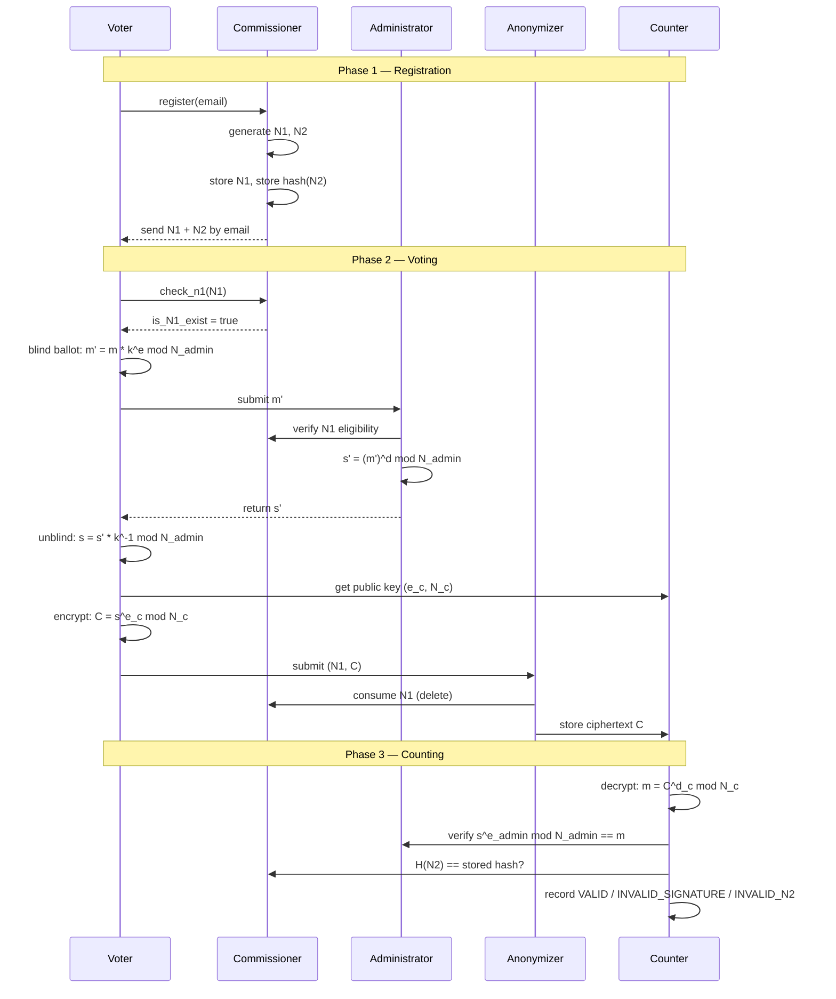

The Crypto E-Voting API implements a five-party RSA blind signature protocol. This page explains the full protocol flow — what each party does, in what order, and why each step is necessary.

## Protocol overview



## N1 and N2 credential scheme

N1 and N2 are the two cryptographic credentials issued to each voter at registration.

**N1** is a one-time authentication nonce. It is stored in plaintext so the Commissioner can validate it by direct lookup. It is permanently deleted the moment the voter submits their ballot — preventing any replay of the credential.

**N2** is a verification nonce. Only the SHA-256 hash of N2 is stored — the Commissioner never holds the plaintext. When the voter casts their ballot, they include N2 in the ballot body. After counting, the Counter extracts N2 from each decrypted ballot and sends it to the Commissioner to check the hash. The voter later uses their N2 to verify their ballot was counted.

## Blind signature scheme

The blind signature prevents the Administrator from learning which candidate the voter chose while still being able to certify the ballot as legitimate.

The voter constructs the ballot `m = (vote, N2, random_bits)` and blinds it:

```
m' = m * k^e mod N_admin
```

where `k` is a random integer with `gcd(k, N_admin) = 1` and `(e, N_admin)` is the Administrator's public key. The Administrator signs the blinded message:

```
s' = (m')^d mod N_admin
```

The voter unblinds the result:

```
s = s' * k^-1 mod N_admin
```

`s` is now a valid RSA signature over `m` — identical in form to what would have been produced by directly signing `m`. The Administrator signed `m` without knowing it.

## Why the Administrator cannot cheat

Expanding the math confirms the guarantee:

```
s' = (m * k^e)^d = m^d * k^(ed) = m^d * k  (mod N)
s  = s' * k^-1 = m^d * k * k^-1 = m^d      (mod N)
```

The blinding factor `k` cancels out perfectly. The Administrator's signature on the blinded message is transformed into a valid signature on the original message by removing `k` — which only the voter knows.

## Double-vote prevention

When the Anonymizer receives a ballot submission, it calls `Commissioner.consume_N1(N1)` before storing the ciphertext. This permanently deletes the N1 record. Any subsequent submission with the same N1 will fail the `is_N1_exist` check and be rejected.

During counting, the Commissioner also verifies that each N2 hash appears exactly once in the `counted_votes` table. Two ballots with the same N2 are impossible under honest operation — N2 is generated with sufficient entropy at registration.

## Anonymization

The Anonymizer sits between the voter and the Counter. It receives the voter's session identity (via N1) alongside the ciphertext, validates and deletes N1, and then writes only the ciphertext to the `votes` table — with no voter reference. The link between identity and ballot content is permanently severed at this step.