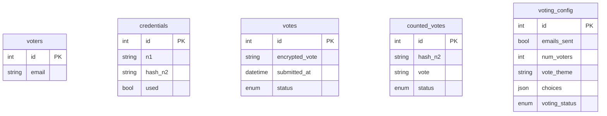
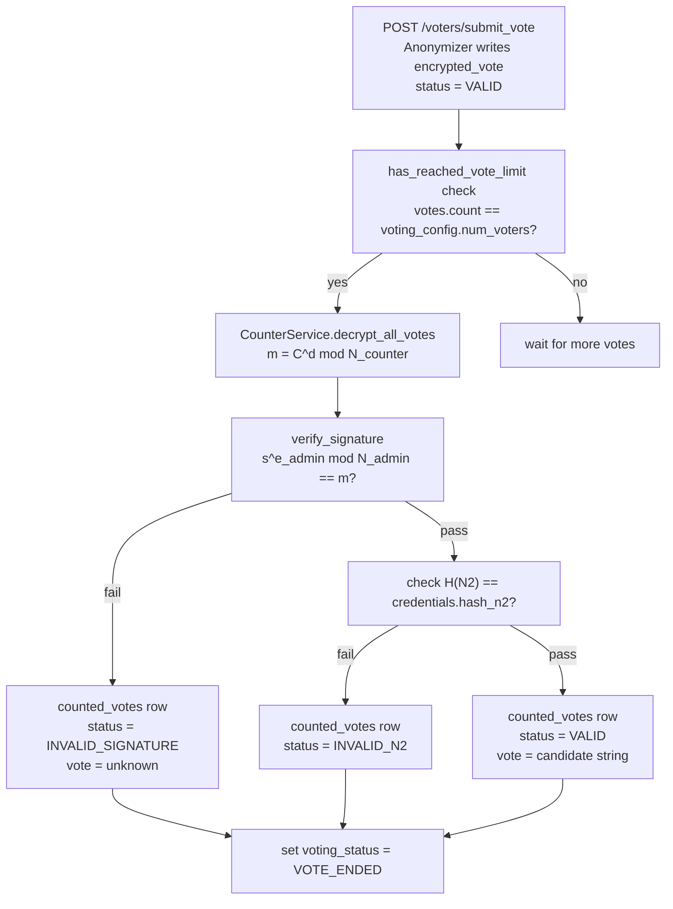

The Crypto E-Voting API persists all state in a PostgreSQL database managed by SQLAlchemy and Alembic. Five ORM models map to five tables. At startup, `Base.metadata.create_all(bind=engine)` ensures the tables exist before the application begins accepting requests.

## Entity relationship diagram



Note that `votes` and `counted_votes` have no foreign key to `voters`. This is the anonymity boundary — voter identity is intentionally decoupled from all ballot records.

---

## voters table

A simple registry of eligible email addresses. No relationship columns.

| Column | Type | Constraints | Description |
|---|---|---|---|
| `id` | Integer | Primary key, indexed | Auto-incremented row identifier |
| `email` | String | Not null, unique | Voter's email address; used for credential delivery only |

```python
class Voter(Base):
    __tablename__ = "voters"
    id = Column(Integer, primary_key=True, index=True)
    email = Column(String, nullable=False, unique=True)
```

---

## credentials table

Stores the one-time authentication tokens issued to each voter when the election opens. N1 is stored as plaintext for direct lookup. N2 is stored only as a SHA-256 hex digest — the plaintext is never written to the database.

| Column | Type | Constraints | Description |
|---|---|---|---|
| `id` | Integer | Primary key, indexed | Auto-incremented row identifier |
| `n1` | String | Not null, unique | Plaintext one-time token; deleted on first use |
| `hash_n2` | String | Not null, unique | SHA-256 hex digest of N2 |
| `used` | Boolean | Not null, default `False` | Whether the credential has been exercised |

The uniqueness constraint on `hash_n2` also acts as a collision guard: two voters cannot share the same N2 fingerprint.

```python
class Credential(Base):
    __tablename__ = "credentials"
    id = Column(Integer, primary_key=True, index=True)
    n1 = Column(String, nullable=False, unique=True)
    hash_n2 = Column(String, nullable=False, unique=True)
    used = Column(Boolean, default=False, nullable=False)
```

---

## votes table

Holds submitted ballots in their encrypted form. No voter identifier or N1/N2 value appears in this table — the anonymizer severs the link before writing the row.

| Column | Type | Constraints | Description |
|---|---|---|---|
| `id` | Integer | Primary key, indexed | Auto-incremented row identifier |
| `encrypted_vote` | String | Not null | RSA ciphertext: `C = s^e mod N` using the counter's public key |
| `submitted_at` | DateTime | Default `utcnow` | UTC timestamp of ballot receipt |
| `status` | Enum(VoteStatus) | Not null, default `VALID` | Submission-level status flag |

**VoteStatus enum**

| Value | Meaning |
|---|---|
| `VALID` | Ballot was accepted and stored for counting |
| `REJECTED` | Ballot was rejected at submission time |

---

## counted_votes table

Populated by `CounterService.process_all_votes` during the tally phase. Each row corresponds to one decrypted, verified ballot.

| Column | Type | Constraints | Description |
|---|---|---|---|
| `id` | Integer | Primary key, indexed | Auto-incremented row identifier |
| `hash_n2` | String | Not null, unique | SHA-256 hash of the N2 extracted from the decrypted ballot |
| `vote` | String | Not null | The candidate string recovered from the ballot |
| `status` | Enum(CountedVoteStatus) | Not null | Outcome of signature and N2 verification checks |

**CountedVoteStatus enum**

| Value | Meaning |
|---|---|
| `VALID` | Both the administrator's signature and the N2 hash check passed |
| `INVALID_SIGNATURE` | RSA verification of the administrator's signature failed; `n2` and `vote` are set to `"unknown"` |
| `INVALID_N2` | Signature was valid but the N2 value was not found in the credential store |

---

## voting_config table

Holds a single configuration record that governs the election's current phase and parameters.

| Column | Type | Constraints | Description |
|---|---|---|---|
| `id` | Integer | Primary key | Row identifier (only one row expected) |
| `emails_sent` | Boolean | Default `False` | Whether credential emails have been dispatched |
| `num_voters` | Integer | Default `5` | Expected total ballots; triggers automatic tally when reached |
| `vote_theme` | String | Nullable | Human-readable description of what voters are choosing |
| `choices` | JSON | Nullable, default `[]` | Ordered list of valid vote choices |
| `voting_status` | Enum(VotingStatus) | Not null, default `REGISTER` | Current phase of the election lifecycle |

**VotingStatus enum**

| Value | Meaning |
|---|---|
| `REGISTER` | Setup phase. Voters can be registered; ballots not yet accepted. |
| `VOTE_STARTED` | Election is open. Credentials distributed; ballots accepted. |
| `VOTE_ENDED` | Election is closed. Ballots counted; results readable. |

---

## Vote lifecycle



Once `voting_status` transitions to `VOTE_ENDED`, `CounterService.finalize_voting` returns immediately with `{"message": "Voting already finalized"}` to prevent double-counting. There is no rollback path in the current implementation.