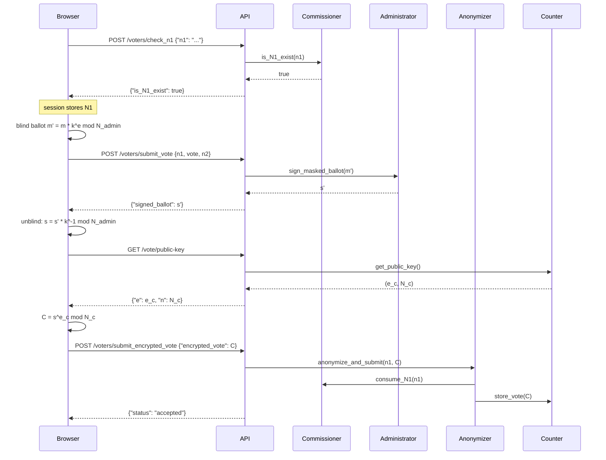

Casting a vote requires three API calls in sequence. The frontend handles all the cryptographic operations between calls. This page documents each call, its expected input, and what the server does with it.

## Full sequence



## Step 1 — Check N1 eligibility

```bash
curl -X POST http://localhost:8000/voters/check_n1 \
  -H "Content-Type: application/json" \
  -d '{"n1": "YOUR_N1_CODE"}'
```

**Success**

```json
{"is_N1_exist": true}
```

**N1 not found or already used**

```json
{"is_N1_exist": false}
```

A server-side session is opened on success. The voter must complete submission within 10 minutes (session `max_age`) or re-authenticate.

## Step 2 — Submit vote for blind signing

The frontend assembles the ballot `m = (vote, n2, random_bits)`, blinds it, and submits alongside the plaintext N1 and vote choice for the signing check.

```bash
curl -X POST http://localhost:8000/voters/submit_vote \
  -H "Content-Type: application/json" \
  -d '{
    "n1": "YOUR_N1_CODE",
    "vote": "Candidate A",
    "n2": "YOUR_N2_CODE"
  }'
```

The server calls `AdministratorService.sign_masked_ballot` and returns the blind signature.

## Step 3 — Submit encrypted ballot

After unblinding the signature and encrypting with the Counter's public key, the browser submits the final ciphertext.

```bash
curl -X POST http://localhost:8000/voters/submit_encrypted_vote \
  -H "Content-Type: application/json" \
  -d '{"encrypted_vote": "CIPHERTEXT_INTEGER_STRING"}'
```

**Success**

```json
{"status": "accepted"}
```

The Anonymizer consumes N1, severs the voter-to-ballot link, and stores the ciphertext. The voter can no longer modify or retract their ballot.

## Error responses

| Status | Reason |
|---|---|
| `403` | Session expired between step 1 and step 3 |
| `400` | Invalid N1 or N2 |
| `409` | Voter has already submitted a ballot |
| `400` | Voting phase is not `vote_started` |