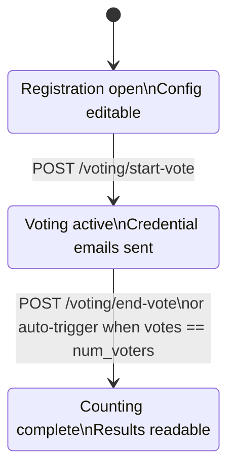

The election lifecycle is controlled through three admin endpoints. All three require the `SECRET_KEY`-signed session to be present — in practice they are called from the admin dashboard.

## Election state machine



Transitions are one-way. There is no rollback in the current implementation.

## Configure the election

```bash
curl -X PATCH http://localhost:8000/config/voting-system-config \
  -H "Content-Type: application/json" \
  -d '{
    "vote_theme": "Best Framework 2025",
    "num_voters": 50,
    "choices": ["React", "Vue", "Svelte"]
  }'
```

Configuration changes are only accepted while `voting_status` is `REGISTER`. Attempting to change config after voting starts returns `403 Forbidden`.

## Start the vote

```bash
curl -X POST http://localhost:8000/voting/start-vote
```

On success:

- `voting_status` transitions from `REGISTER` to `VOTE_STARTED`
- N1 and N2 credentials are generated for every registered voter
- Credential emails are sent via the Gmail API
- `emails_sent` is set to `True` in `voting_config`

**Response**

```json
{"message": "Vote started successfully"}
```

## End the vote

```bash
curl -X POST http://localhost:8000/voting/end-vote
```

On success:

- `voting_status` transitions from `VOTE_STARTED` to `VOTE_ENDED`
- `CounterService.finalize_voting` is called immediately
- All ballots are decrypted, verified, and written to `counted_votes`
- Results become available at `GET /results/tally`

**Response**

```json
{"message": "Vote ended successfully"}
```

## Auto-trigger

When the number of rows in `votes` equals `voting_config.num_voters`, the Anonymizer calls `CounterService.finalize_voting` automatically — without waiting for the admin to click End Vote. This means if all expected voters cast their ballots, the election closes and results are published without any admin action. The admin can still call `POST /voting/end-vote` manually before this threshold is reached.