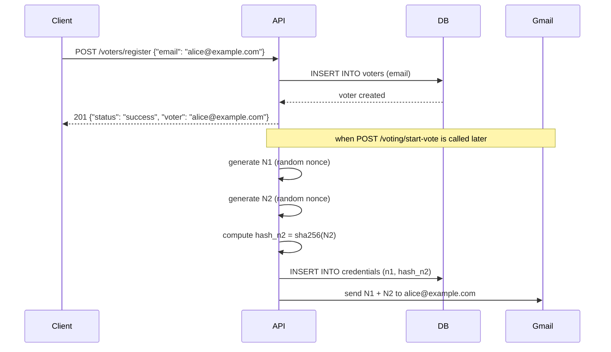

Voter registration is the process of adding an eligible email address to the election and issuing that voter their N1 and N2 credentials. Registration must happen before the election moves to the `vote_started` phase.

## How registration works



Voters are registered first with their email only. N1 and N2 credentials are generated and emailed when the administrator calls `POST /voting/start-vote`, not at registration time. This allows the administrator to add all voters before opening the election.

## Register a voter

```bash
curl -X POST http://localhost:8000/voters/register \
  -H "Content-Type: application/json" \
  -d '{"email": "alice@example.com"}'
```

**Success — HTTP 201**

```json
{
  "status": "success",
  "message": "Voter registered successfully",
  "voter": "alice@example.com"
}
```

**Email already registered — HTTP 409**

```json
{
  "status": "error",
  "message": "Email already exists",
  "voter": "alice@example.com"
}
```

## Constraints

- Registration is only accepted while `voting_status` is `REGISTER`. Attempting to register after the vote has started returns `403 Forbidden`.
- Each email address can be registered only once per election.
- The number of registered voters can exceed `num_voters` in the config, but only `num_voters` ballots will be accepted before automatic tally is triggered.

## Checking registered voters

The admin dashboard shows the current registration count. There is no admin API endpoint to list individual voter emails — only the aggregate count is exposed.