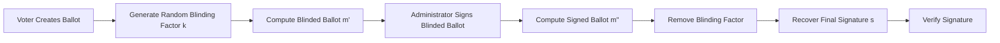

<Info>
Blind signatures allow a ballot to be authenticated without revealing its content to the signer.
</Info>

Blind signatures are one of the core privacy mechanisms used in CryptoVote.

They allow the Administrator to validate a ballot without ever seeing the original vote, ensuring that authentication and anonymity remain separated throughout the protocol.

<CardGroup cols={4}>
  <Card title="Blind" icon="shield">
    Hide the ballot mathematically.
  </Card>

  <Card title="Sign" icon="key">
    Generate a signature on the blinded ballot.
  </Card>

  <Card title="Unblind" icon="lock">
    Remove the temporary blinding factor.
  </Card>

  <Card title="Verify" icon="check-circle">
    Validate the final RSA signature.
  </Card>
</CardGroup>

---

## Core Principle

Instead of signing the original ballot directly, the protocol temporarily transforms it into a blinded version using a random factor `k`.

The signer only interacts with the blinded message, never with the actual ballot itself.

---

## Blind Signature Workflow

---

## Ballot Blinding

The voter selects a random value `k` satisfying:

$$
gcd(k, N) = 1
$$

The ballot is then transformed into a blinded message:

$$
m' = m \cdot k^e \pmod N
$$

Where:
- `m` is the original ballot,
- `(e, N)` is the Administrator public key.

At this stage, the Administrator only receives the blinded value `m'`.

<Note>
The original ballot remains hidden during the entire signing process.
</Note>

---

## Blind Signature Generation

The Administrator signs the blinded ballot using the RSA private key:

$$
m'' = (m')^d \pmod N
$$

Although the message is hidden, the resulting signature remains mathematically valid.

The signer never gains access to the original ballot content.

---

## Signature Unblinding

After receiving the signed blinded ballot, the voter removes the blinding factor using the modular inverse of `k`:

$$
s = m'' \cdot k^{-1} \pmod N
$$

The resulting value `s` becomes a valid RSA signature for the original ballot.

---

## Signature Verification

The final signature is verified using the Administrator public key:

$$
s^e \equiv m \pmod N
$$

If the equation holds:
- the signature is valid,
- the ballot is authentic,
- and the message has not been modified.

---

## Security Properties

| Property | Description |
|---|---|
| Ballot Anonymity | The signer never learns the ballot content |
| Signature Validity | The final signature remains cryptographically correct |
| Authentication | Only approved ballots receive signatures |
| Identity Separation | Votes cannot be linked back to voters |
| Integrity Protection | Modified ballots fail verification |

---

## Mathematical Foundation

The correctness of the protocol relies on:
- modular arithmetic,
- multiplicative inverses,
- Euler’s theorem,
- and RSA algebraic properties.

The protocol guarantees mathematically that:

$$
s = m^d \pmod N
$$

even though the signer never directly observes `m`.

---

## Role in CryptoVote

Inside CryptoVote, blind signatures:
- authenticate ballots,
- preserve voter anonymity,
- and prevent direct vote traceability.

This mechanism forms one of the primary privacy guarantees of the entire voting protocol.

---

## Continue Reading

<CardGroup cols={2}>
  <Card
    title="RSA Cryptography"
    icon="key"
    href="/crypto/rsa"
  >
    RSA key generation, encryption, and signature verification.
  </Card>

  <Card
    title="Hashing"
    icon="lock"
    href="/crypto/hashing"
  >
    Secure verification codes and integrity protection.
  </Card>

  <Card
    title="Vote Lifecycle"
    icon="globe"
    href="/crypto/vote-lifecycle"
  >
    End-to-end voting process walkthrough.
  </Card>

  <Card
    title="Cryptographic Protocol"
    icon="shield"
    href="/crypto/protocol"
  >
    Complete protocol architecture and workflow.
  </Card>
</CardGroup>