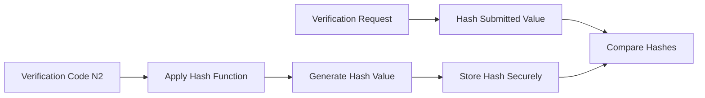

<Info>
CryptoVote uses cryptographic hashing to protect verification codes and preserve vote integrity without exposing sensitive data.
</Info>

Hash functions play a critical role in the protocol by allowing the system to verify information without storing or transmitting the original values directly.

Inside CryptoVote, hashing is primarily used to:
- protect voter verification codes,
- prevent information disclosure,
- and validate ballot integrity during verification workflows.

<CardGroup cols={3}>
  <Card title="Verification" icon="shield">
    Validate voter information securely.
  </Card>

  <Card title="Integrity" icon="lock">
    Detect unauthorized modifications.
  </Card>

  <Card title="Protection" icon="key">
    Hide sensitive verification values.
  </Card>
</CardGroup>

---

## What Is a Hash Function?

A cryptographic hash function transforms an input of arbitrary size into a fixed-size output called a hash value.

The transformation is:
- deterministic,
- one-way,
- and computationally irreversible.

For a message `m`, the resulting hash becomes:

$$
H(m)
$$

Even a small modification to the original message produces a completely different hash value.

---

## Hashing Workflow



---

## Verification Code Protection

During initialization:
- each voter receives a verification code `N2`,
- the original value is kept private,
- and only its hash is distributed for verification purposes.

Instead of storing:

```txt
N2
```

the system stores:

$$
H(N2)
$$

This prevents direct disclosure of verification data even if database records are exposed.

<Warning>
Plaintext verification codes should never be permanently stored inside the verification workflow.
</Warning>

---

## Verification Process

Later in the protocol:
- the voter submits `N2`,
- the system hashes the submitted value,
- and compares the result with the stored hash.

Verification succeeds only if:

$$
H(N2_{submitted}) = H(N2_{stored})
$$

This mechanism allows validation without revealing the original stored value.

---

## Security Properties

| Property | Description |
|---|---|
| One-Way Transformation | Original values cannot be recovered from hashes |
| Integrity Protection | Modified values produce different hashes |
| Collision Resistance | Different inputs should not generate identical hashes |
| Verification Security | Sensitive values remain hidden during validation |
| Data Minimization | Original verification codes are not persistently exposed |

---

## Avalanche Effect

Cryptographic hash functions exhibit the avalanche effect:
- a minimal input change produces a completely different output.

Example:

| Input | Hash Result |
|---|---|
| `VoteA` | `8f14e45fceea167a5a36dedd4bea2543` |
| `VoteB` | `c9f0f895fb98ab9159f51fd0297e236d` |

This property helps detect even minor unauthorized modifications.

---

## Role in CryptoVote

Inside CryptoVote, hashing strengthens both:
- privacy,
- and integrity.

It ensures that:
- verification codes remain protected,
- sensitive values are never directly exposed,
- and validation can occur securely throughout the protocol lifecycle.

Hashing therefore complements:
- RSA cryptography,
- and blind signatures

by securing verification workflows independently of ballot encryption.

---

## Trust Separation

Hashing also supports the protocol’s distributed trust model.

Because only hashed values are exchanged:
- verification services cannot recover original codes,
- intermediate systems cannot reconstruct voter secrets,
- and stored verification data remains protected even in partial compromise scenarios.

---

## Mathematical Perspective

A hash function maps an arbitrary input:

$$
m
$$

to a fixed-size output:

$$
H(m)
$$

The process is intentionally designed to make inverse computation computationally infeasible.

---

## Continue Reading

<CardGroup cols={2}>
  <Card
    title="Blind Signatures"
    icon="shield"
    href="/crypto/blind-signature"
  >
    Anonymous ballot authentication and signature blinding.
  </Card>

  <Card
    title="RSA Cryptography"
    icon="key"
    href="/crypto/rsa"
  >
    Encryption, decryption, and RSA signature operations.
  </Card>

  <Card
    title="Cryptographic Protocol"
    icon="lock"
    href="/crypto/protocol"
  >
    Full protocol architecture and security workflow.
  </Card>
</CardGroup>