<Info>
This section focuses on the cryptographic workflow of the CryptoVote protocol, including ballot authentication, encryption, anonymity preservation, and verification.
</Info>

CryptoVote is built around a cryptographic voting protocol designed to guarantee **voter anonymity**, **ballot authenticity**, **vote confidentiality**, and **election integrity**.

The system combines **RSA cryptography**, **blind signatures**, **secure hashing**, and **distributed trust separation** to validate votes without revealing voter identity.

<CardGroup cols={3}>
  <Card
    title="RSA"
    icon="key"
    href="/crypto/rsa"
  >
    Encryption and digital signature operations.
  </Card>

  <Card
    title="Blind Signatures"
    icon="shield"
    href="/crypto/blind-signature"
  >
    Anonymous ballot authentication workflow.
  </Card>

  <Card
    title="Hashing"
    icon="lock"
    href="/crypto/hashing"
  >
    Secure voter verification and integrity protection.
  </Card>
</CardGroup>

---

## Protocol Objectives

| Objective | Description |
|---|---|
| Voter Eligibility | Only authorized voters may participate |
| Ballot Anonymity | Votes cannot be linked to voter identities |
| Vote Integrity | Ballots cannot be modified after submission |
| Confidentiality | Votes remain encrypted before counting |
| Verifiability | Votes can later be validated securely |
| Non-Repudiation | Ballots must contain valid administrator signatures |

---

## Core Cryptographic Components

### RSA Public-Key Cryptography

RSA is used for:
- ballot encryption,
- digital signatures,
- and signature verification.

The protocol relies on:
- a public key `(e, N)`,
- and a private key `(d, N)`.

### Blind Signatures

Blind signatures allow a voter to obtain a valid administrator signature without revealing ballot contents during the signing process.

This mechanism preserves anonymity while maintaining ballot authenticity.

### Hash Functions

Hashing protects verification codes (`N2`) using one-way cryptographic transformations.

Only hashed values are used during verification workflows.

---

## Protocol Lifecycle

<CardGroup cols={3}>
  <Card title="Initialization" icon="key">
    Generate credentials and verification codes.
  </Card>

  <Card title="Voting" icon="shield">
    Authenticate, sign, encrypt, and submit ballots.
  </Card>

  <Card title="Counting" icon="bar-chart">
    Decrypt, verify, and count valid ballots.
  </Card>
</CardGroup>

---

## Phase 1: Initialization

During initialization:
- voter credentials are generated,
- unique authentication codes (`N1`) are assigned,
- verification codes (`N2`) are created,
- and hashes of `N2` are distributed securely.

<Warning>
Plaintext verification codes are never permanently stored inside the verification workflow.
</Warning>

---

## Phase 2: Voting

The voting phase combines authentication, blind signatures, encryption, and anonymous submission.

### 2.1 Authentication

The voter authenticates using:

```txt
N1
```

This confirms voting eligibility before ballot submission.

---

### 2.2 Ballot Construction

The voter prepares a ballot containing:
- the selected vote,
- the verification code `N2`,
- and random entropy values.

These additional values strengthen uniqueness and integrity.

---

### 2.3 Ballot Blinding

Before signature generation, the ballot is mathematically blinded using a random factor `k`.

The blinded ballot becomes:

$$
m' = m \cdot k^e \pmod N
$$

Where:
- `m` represents the original ballot,
- `(e, N)` is the Administrator public key.

At this stage, the Administrator cannot recover the original ballot contents.

---

### 2.4 Blind Signature Generation

The Administrator signs the blinded ballot using the RSA private key:

$$
m'' = (m')^d \pmod N
$$

Although the ballot remains hidden, the generated signature stays mathematically valid.

---

### 2.5 Signature Unblinding

After receiving the signed blinded ballot, the voter removes the blinding factor:

$$
s = m'' \cdot k^{-1} \pmod N
$$

The resulting value becomes a valid RSA signature for the original ballot.

---

### 2.6 Vote Encryption

The signed ballot is encrypted using the Counter public key before transmission.

This ensures that:
- vote contents remain confidential,
- intermediate services cannot read ballots,
- and decryption only occurs during counting.

---

### 2.7 Anonymous Submission

The encrypted ballot is transmitted to the Anonymizer.

The Anonymizer:
- validates submission legitimacy,
- stores encrypted ballots,
- and removes direct identity association before counting.

---

## Phase 3: Counting

After the election closes:
- encrypted ballots are decrypted,
- administrator signatures are verified,
- verification hashes are validated,
- and valid ballots are counted.

### 3.1 Signature Verification

The Counter verifies ballot authenticity using:

$$
s^e \equiv m \pmod N
$$

Only correctly signed ballots are accepted into the final count.

---

## Blind Signature Workflow

```mermaid
flowchart LR

    A[Voter Creates Ballot]
    B[Generate Random Blinding Factor k]
    C["Compute Blinded Ballot m'"]
    D[Administrator Signs Blinded Ballot]
    E["Compute Signed Ballot m''"]
    F[Remove Blinding Factor]
    G[Recover Final Signature s]
    H[Encrypt Ballot]
    I[Anonymous Submission]
    J[Counting and Verification]

    A --> B
    B --> C
    C --> D
    D --> E
    E --> F
    F --> G
    G --> H
    H --> I
    I --> J
```



---

## Security Properties

| Property | Mechanism |
|---|---|
| Anonymous authentication | Blind signatures |
| Ballot confidentiality | RSA encryption |
| Vote integrity | RSA signature verification |
| Eligibility enforcement | N1 validation |
| Verification protection | Hash(N2) |
| Double-count prevention | Unique verification hashes |

---

## Trust Distribution Model

The protocol intentionally distributes trust across independent logical entities.

| Entity | Can Verify | Cannot Know |
|---|---|---|
| Administrator | Ballot legitimacy | Vote content |
| Commissioner | Eligibility validity | Final vote |
| Counter | Vote content | Voter identity |
| Anonymizer | Submission legitimacy | Decrypted ballot |

This separation prevents any single authority from compromising the election process independently.

---

## Mathematical Foundation

The protocol relies heavily on:
- modular arithmetic,
- Euler’s theorem,
- multiplicative inverses,
- and RSA algebraic properties.

The blind signature mechanism guarantees mathematically that:

$$
s = m^d \pmod N
$$

even though the signer never directly observes the original ballot.

---

## Continue Reading

<CardGroup cols={2}>
  <Card
    title="Blind Signatures"
    icon="shield"
    href="/crypto/blind-signature"
  >
    Mathematical proof and complete blind signature workflow.
  </Card>

  <Card
    title="RSA Cryptography"
    icon="key"
    href="/crypto/rsa"
  >
    RSA key generation, encryption, decryption, and verification.
  </Card>

  <Card
    title="Hashing"
    icon="lock"
    href="/crypto/hashing"
  >
    Verification hashes and integrity protection mechanisms.
  </Card>

  <Card
    title="Vote Lifecycle"
    icon="globe"
    href="/crypto/vote-lifecycle"
  >
    End-to-end voting workflow from authentication to counting.
  </Card>
</CardGroup>