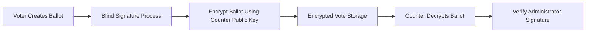

<Info>
CryptoVote relies on RSA public-key cryptography for ballot encryption, signature generation, and signature verification.
</Info>

RSA is one of the foundational cryptographic mechanisms used throughout the voting protocol.

****Inside CryptoVote, RSA is responsible for:****
- protecting ballot confidentiality,
- authenticating ballots,
- and validating cryptographic signatures.

****The protocol uses:****
- a public key `(e, N)`,
- and a private key `(d, N)`.

---

## RSA Overview

RSA is an asymmetric cryptographic algorithm based on modular arithmetic and prime factorization.

****The system uses:****
- a **public key** for encryption and verification,
- and a **private key** for decryption and signing.

<CardGroup cols={3}>
  <Card title="Encryption" icon="lock">
    Protect ballot confidentiality before counting.
  </Card>

  <Card title="Decryption" icon="key">
    Recover encrypted ballots during the counting phase.
  </Card>

  <Card title="Signatures" icon="shield">
    Authenticate ballots and validate integrity.
  </Card>
</CardGroup>

---

## RSA Key Generation

RSA key generation follows several mathematical steps.

### 1. Choose Prime Numbers

Select two distinct prime numbers:

$$
p \quad \text{and} \quad q
$$

---

### 2. Compute the Modulus

The RSA modulus becomes:

$$
N = p \times q
$$

This value is shared publicly.

---

### 3. Compute Euler's Totient

$$
\phi(N) = (p - 1)(q - 1)
$$

---

### 4. Choose the Public Exponent

Choose a value `e` such that:

$$
1 < e < \phi(N)
$$

and:

$$
gcd(e, \phi(N)) = 1
$$

---

### 5. Compute the Private Key

Compute `d` satisfying:

$$
d \cdot e \equiv 1 \pmod{\phi(N)}
$$

The pair `(d, N)` forms the private key.

<Warning>
The private key must never be exposed or transmitted.
</Warning>

---

## RSA Operations

### Encryption

RSA encryption protects ballot confidentiality before counting.

The encrypted ciphertext becomes:

$$
C = M^e \pmod N
$$

Where:
- `M` is the original message,
- `C` is the encrypted ciphertext.

---

### Decryption

The counter decrypts ballots using the RSA private key:

$$
M = C^d \pmod N
$$

Only the holder of the private key can recover the original ballot.

---

### Digital Signatures

RSA signatures authenticate ballots and guarantee integrity.

The signature becomes:

$$
s = m^d \pmod N
$$

Where:
- `m` is the message,
- `s` is the signature.

---

### Signature Verification

Verification uses the public key:

$$
s^e \equiv m \pmod N
$$

If the equality holds:
- the signature is valid,
- and the message has not been modified.

---

## RSA Workflow in CryptoVote

---

## Example Parameters

The project exercises demonstrate RSA operations using:

| Parameter | Value |
|---|---|
| Modulus | `N = 55` |
| Public Exponent | `e = 27` |
| Private Key | `d = 3` |

These simplified values are used for educational demonstration purposes.

---

## Security Properties

| Property | Role in CryptoVote |
|---|---|
| Confidentiality | Protects ballots before counting |
| Integrity | Detects ballot modification |
| Authentication | Validates administrator signatures |
| Non-Repudiation | Prevents signature denial |
| Controlled Access | Only private key holders can decrypt |

---

## Why RSA Fits Electronic Voting

RSA integrates naturally with blind signatures and modular arithmetic workflows.

This makes it suitable for:
- anonymous authentication,
- encrypted ballot transmission,
- and signature-based verification systems.

Its algebraic properties enable:
- ballot blinding,
- unblinding,
- and secure verification

without revealing vote contents.

<Note>
Blind signatures used in CryptoVote are built directly on top of RSA signature operations.
</Note>

---

## Mathematical Foundation

RSA security relies on the computational difficulty of:

$$
N = p \times q
$$

Specifically:
- multiplying large primes is easy,
- but factoring large composite numbers is computationally infeasible.

This asymmetry forms the basis of RSA security.

---

## Role in CryptoVote

Inside the protocol:
- the Administrator uses RSA for blind signature generation,
- the Counter uses RSA for ballot encryption and decryption,
- and voters rely on RSA verification to validate ballot authenticity.

RSA therefore supports both:
- confidentiality,
- and authenticity

throughout the election lifecycle.

---

## Continue Reading

<CardGroup cols={2}>
  <Card
    title="Blind Signatures"
    icon="shield"
    href="/crypto/blind-signature"
  >
    Anonymous ballot authentication using RSA blinding.
  </Card>

  <Card
    title="Hashing"
    icon="lock"
    href="/crypto/hashing"
  >
    Verification hashes and integrity protection.
  </Card>

  <Card
    title="Vote Lifecycle"
    icon="globe"
    href="/crypto/vote-lifecycle"
  >
    End-to-end voting workflow and ballot processing.
  </Card>

  <Card
    title="Cryptographic Protocol"
    icon="key"
    href="/crypto/protocol"
  >
    Full protocol architecture and cryptographic flow.
  </Card>
</CardGroup>