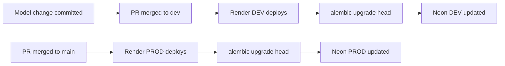

CryptoVote uses Alembic to manage all database schema changes. Alembic tracks every change made to the schema over time as versioned migration scripts. Each script describes exactly what changed and how to undo it. This ensures that every environment, local, DEV, and PROD, always runs the same schema in the same order.

---

## Why Alembic

Without a migration tool, schema changes applied manually on one environment would not be reflected on others. A developer who runs `ALTER TABLE` directly on their local database has no way to guarantee that the same change reaches Neon DEV or Neon PROD in the correct order. Alembic solves this by making every schema change a versioned file that is committed to the repository and applied automatically on deploy.

<Warning>
No schema change is allowed without a migration file. This rule has no exceptions. Adding a column, renaming a table, changing a type, adding a constraint, all of these require a migration. Sophia owns all migration files. No one else generates or modifies them without her approval.
</Warning>

---

## Migration Workflow

The correct sequence for any schema change:

<Steps>
  <Step title="Modify the SQLAlchemy model">
    Make the change in the model class inside `app/models/`. Do not run the application yet.
  </Step>
  <Step title="Generate the migration file">
```bash
    alembic revision --autogenerate -m "describe what changed"
```
    Alembic compares the current model definitions against the last known schema state and generates a migration script in `alembic/versions/`. The `-m` flag sets the description that appears in the filename.
  </Step>
  <Step title="Review the generated file">
    Open the file in `alembic/versions/` and verify that the `upgrade()` and `downgrade()` functions match your intent exactly. Autogenerate is reliable but not perfect. Always review before applying.
  </Step>
  <Step title="Apply locally">
```bash
    alembic upgrade head
```
    This applies all pending migrations up to the latest version. Run this and test your changes locally before committing.
  </Step>
  <Step title="Commit both files together">
    The migration file and the model change must be committed in the same commit. Never commit one without the other.
```bash
    git add app/models/your_model.py alembic/versions/xxxx_describe_what_changed.py
    git commit -m "db: add column to credentials table"
```
  </Step>
</Steps>

---

## Automatic Deployment

On every deploy, Render runs the following startup command before the server starts:

```bash
alembic upgrade head && uvicorn main:app --host 0.0.0.0 --port $PORT
```

This means migrations are applied automatically on both Render DEV and Render PROD every time a new version is deployed. No manual intervention is required.



---

## Useful Commands

| Command | Description |
|---|---|
| `alembic upgrade head` | Apply all pending migrations |
| `alembic downgrade -1` | Roll back the last applied migration |
| `alembic current` | Show the current migration version |
| `alembic history` | List all migrations in order |
| `alembic revision --autogenerate -m "description"` | Generate a new migration from model changes |

---

## Migration File Structure

Every generated migration file follows this structure:

```python
"""describe what changed

Revision ID: a3f9c1d82e44
Revises: b1e7d0c63f21
Create Date: 2026-03-12 14:22:05
"""

from alembic import op
import sqlalchemy as sa

def upgrade():
    # forward change
    op.add_column("credentials", sa.Column("used", sa.Boolean(), nullable=False, server_default="false"))

def downgrade():
    # reverse change
    op.drop_column("credentials", "used")
```

The `upgrade()` function applies the change. The `downgrade()` function reverses it. Both must be present and correct.

---

## Rules

<Warning>
Never edit an already-applied migration file. The migration history is a chain. Editing an applied file breaks the chain for every environment that has already run it.
</Warning>

<Warning>
Never delete a migration file. Even if a migration introduced a change that was later reversed, the file must stay in the repository. Remove the change by writing a new migration that undoes it.
</Warning>

<Warning>
Never run `ALTER TABLE` or `CREATE TABLE` manually on any deployed database. Manual changes are invisible to Alembic and will cause the migration state to diverge from the actual schema, breaking all future migrations.
</Warning>

<Note>
Local SQLite and Neon DEV must always be at the same migration version before integration testing begins. Run `alembic current` on both to verify they are in sync.
</Note>

---

<CardGroup cols={2}>
  <Card title="Schema" icon="table" href="/database/schema">
    Table structure, column definitions, and design decisions.
  </Card>
  <Card title="Security Rules" icon="shield" href="/database/security-rules">
    N2 lifecycle, access restrictions, and data security rules.
  </Card>
</CardGroup>