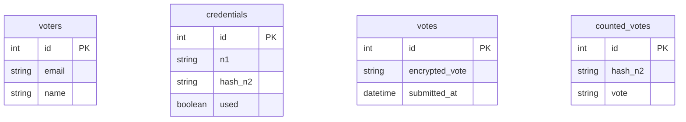
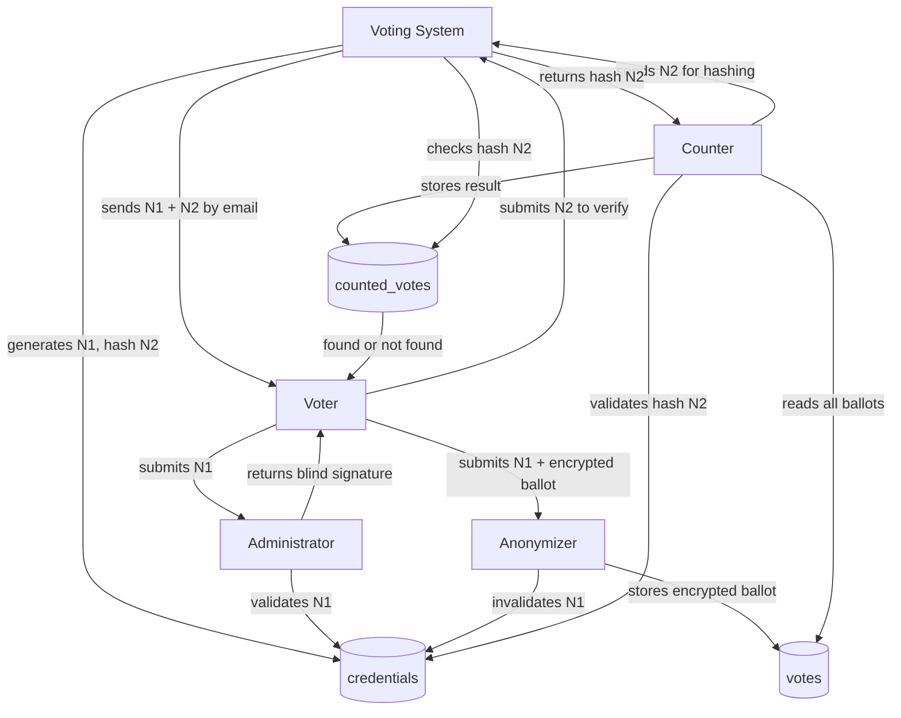

The CryptoVote database is composed of four tables. Each table is owned by exactly one service and accessed exclusively through its corresponding repository class. No service queries the database directly.

The most important design decision in the schema is the intentional absence of foreign keys between the identity tables (`voters`, `credentials`) and the vote tables (`votes`, `counted_votes`). This separation is not an oversight — it is the structural enforcement of ballot anonymity. No join can ever link a voter's identity to their ballot.

<Note>
There are no foreign keys between `voters`/`credentials` and `votes`/`counted_votes`. This is intentional. Any relational link between these tables would allow an attacker with database access to trace a ballot back to a voter.
</Note>

---

## voters

Owned by `voting_system_service`. This table holds the list of registered voters. It is read during initialization to retrieve voter emails for sending N1/N2 credentials. It is never written to by the application at runtime.

| Column | Type | Constraints | Description |
|---|---|---|---|
| `id` | integer | PRIMARY KEY | Auto-incremented row identifier |
| `email` | string | NOT NULL, UNIQUE | Voter email address, used to send credentials |
| `name` | string | NOT NULL | Voter full name |

---

## credentials

Owned by `commissioner_service`. This table stores the authentication codes issued to each voter. It holds N1 in plaintext for validation purposes and `hash(N2)` as a fingerprint. N2 itself is never stored here or anywhere else in the database.

| Column | Type | Constraints | Description |
|---|---|---|---|
| `id` | integer | PRIMARY KEY | Auto-incremented row identifier |
| `n1` | string | NOT NULL, UNIQUE | 12-character alphanumeric voter authentication code |
| `hash_n2` | string | NOT NULL, UNIQUE | SHA-256 digest of N2, used for ballot validation during counting |
| `used` | boolean | NOT NULL, DEFAULT false | Set to `true` atomically when the voter submits their ballot |

The `used` flag is the mechanism that prevents double voting at the authentication layer. When the Anonymizer submits a vote, the Commissioner executes a transaction-safe `UPDATE` that sets `used = TRUE` for that N1. Any subsequent submission with the same N1 fails validation before the vote is stored.

<Warning>
N2 is never stored in this table or any other table. The Commissioner receives only `hash(N2)` from the Voting System. Storing N2 in plaintext here would allow anyone with database access to forge valid ballots.
</Warning>

---

## votes

Owned by `anonymizer_service`. This table is the ballot box. It stores encrypted votes with no identity linkage whatsoever. The Anonymizer writes to this table only after the Commissioner has validated and invalidated N1. There is no column referencing the voter, their N1, or their N2.

| Column | Type | Constraints | Description |
|---|---|---|---|
| `id` | integer | PRIMARY KEY | Auto-incremented row identifier |
| `encrypted_vote` | string | NOT NULL | Ballot encrypted with the Counter's RSA public key |
| `submitted_at` | datetime | NOT NULL, DEFAULT now | Timestamp of submission |

The ballot is encrypted with the Counter's public key before it reaches the Anonymizer. The Anonymizer stores the ciphertext without ever being able to read its content.

---

## counted_votes

Owned by `counter_service`. This table holds the final validated vote results. It is written to during the counting phase only, after the Counter has decrypted each ballot, verified the Administrator's signature, and validated `hash(N2)` with the Commissioner.

| Column | Type | Constraints | Description |
|---|---|---|---|
| `id` | integer | PRIMARY KEY | Auto-incremented row identifier |
| `hash_n2` | string | NOT NULL, UNIQUE | SHA-256 digest of N2, used as the unique ballot identifier |
| `vote` | string | NOT NULL | The decrypted vote choice |

The `UNIQUE` constraint on `hash_n2` is the second layer of double-vote prevention. Even if two ballots carrying the same N2 somehow reached the Counter, only the first `INSERT` would succeed. The second would raise a unique constraint violation and be discarded.

<Note>
After counting is complete, the pairs formed by `hash_n2` and `vote` can be published publicly. Any voter can submit their N2 to the Voting System, which hashes it and checks whether that hash appears in `counted_votes`. This is the verifiability guarantee.
</Note>

---

## Design Decisions

**No foreign keys across the identity/vote boundary.**
The `voters` and `credentials` tables belong to the identity side of the protocol. The `votes` and `counted_votes` tables belong to the vote side. There is no foreign key, no shared column, and no join path between these two groups. A database dump reveals nothing about who voted for what.

**N2 never persisted.**
N2 is generated in memory by the Voting System, emailed to the voter, hashed immediately, and discarded. The hash is stored in `credentials` and later validated in `counted_votes`. The plaintext never touches disk at any point.

**`hash_n2` as the ballot identifier.**
Using `hash(N2)` as the unique identifier in `counted_votes` serves two purposes: it enforces uniqueness (preventing double counting) and it enables post-election verifiability (any voter can verify their vote was counted by providing N2).

**`submitted_at` in `votes`.**
The timestamp exists for operational purposes only, not for voter identification. Since the Anonymizer strips all identity information before storing the ballot, the timestamp cannot be used to correlate a submission with a voter.

---

## Environment Mapping

The same schema is used across all environments. The database engine changes but the table definitions do not.

| Environment | Engine | Applied by |
|---|---|---|
| Local | SQLite | Developer runs `alembic upgrade head` manually |
| DEV | Neon PostgreSQL | Render runs `alembic upgrade head` on startup |
| PROD | Neon PostgreSQL | Render runs `alembic upgrade head` on startup |

<Warning>
SQLite is used locally only. Never configure a deployed service to use SQLite. The `DATABASE_URL` environment variable controls which engine is used and must always be set correctly in the Render dashboard.
</Warning>

---

## Schema Diagram with Data Flow

The following diagram shows how data flows through the four tables during a complete election lifecycle.

<CardGroup cols={2}>
  <Card title="Migrations" icon="arrows-rotate" href="/database/migrations">
    How schema changes are tracked, applied, and deployed using Alembic.
  </Card>
  <Card title="Security Rules" icon="shield" href="/database/security-rules">
    N2 lifecycle, access restrictions, and data security rules.
  </Card>
</CardGroup>