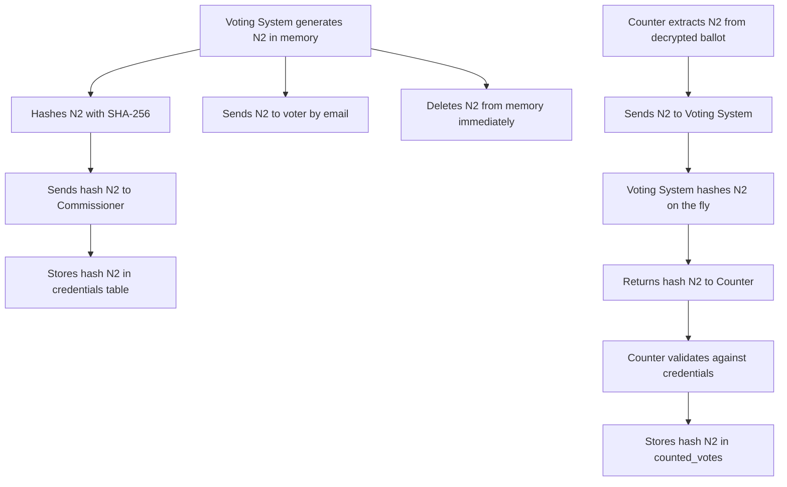
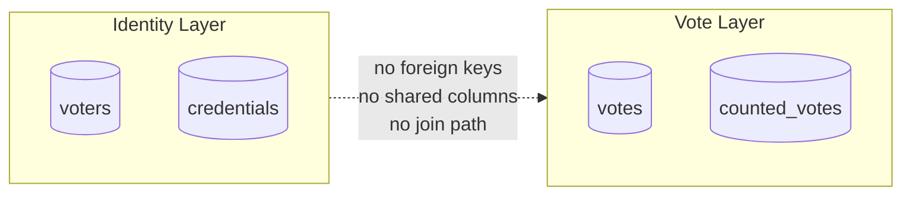

The database layer is the last line of defense in the CryptoVote protocol. Cryptographic protections handle anonymity and integrity at the protocol level, but the rules on this page govern how data is stored, accessed, and protected at the infrastructure level. Both layers must hold for the system to be secure.

---

## N2 Lifecycle

N2 is the most sensitive value in the entire protocol. It is the only credential that proves a ballot is valid during counting, and it is the key to post-election verifiability. It is also the value that must never be persisted.

<Warning>
N2 never touches the database at any point in its lifecycle. The only values persisted are `hash(N2)` in `credentials` and `hash(N2)` in `counted_votes`. Storing N2 in plaintext anywhere in the database is a zero-tolerance security breach.
</Warning>

---

## Data Access Rules

Every rule below is enforced by the repository layer. No service or route accesses the database directly.

<Steps>
  <Step title="Repository layer is mandatory">
    All database access goes through the three repository classes: `credential_repository`, `vote_repository`, and `counted_vote_repository`. Services call repository methods. They never construct or execute queries directly.
  </Step>
  <Step title="Hash functions belong to one service">
    Only `voting_system_service` calls hash functions. No other service computes `hash(N2)` or calls anything inside `hash_utils` directly. This ensures that the hashing logic cannot be bypassed or substituted by any other part of the system.
  </Step>
  <Step title="No raw SQL outside repositories">
    SQLAlchemy ORM is used exclusively. No raw SQL strings, no direct `execute()` calls outside the repository layer. This applies to all four tables across all environments.
  </Step>
  <Step title="No direct access to PROD">
    No developer has direct access to the Neon PROD database during development. All schema changes go through Alembic migrations. All data changes go through the application layer.
  </Step>
</Steps>

---

## Table Access Matrix

Each table is owned by exactly one service and accessed through exactly one repository. This table defines the complete access boundary.

| Table | Owner service | Repository | Read | Write |
|---|---|---|---|---|
| `voters` | `voting_system_service` | none, direct ORM read | Yes | No |
| `credentials` | `commissioner_service` | `credential_repository` | Yes | Yes |
| `votes` | `anonymizer_service` | `vote_repository` | Yes | Yes |
| `counted_votes` | `counter_service` | `counted_vote_repository` | Yes | Yes |

<Note>
`voters` is the only table accessed without a dedicated repository. The Voting System reads voter emails directly via ORM during initialization. It never writes to this table at runtime.
</Note>

---

## Identity and Vote Separation

The schema enforces a hard boundary between the identity side of the protocol and the vote side. This boundary exists at the data model level, not just at the application level.

There are no foreign keys between these two groups. There are no shared columns. No query can join across this boundary. A full database dump reveals nothing about which voter cast which ballot.

---

## Constraint Rules

<CardGroup cols={2}>
  <Card title="UNIQUE on credentials.n1" icon="key">
    Each N1 code is issued to exactly one voter. Duplicate N1 values are rejected at the database level before any application logic runs.
  </Card>
  <Card title="UNIQUE on credentials.hash_n2" icon="fingerprint">
    Each `hash(N2)` fingerprint corresponds to exactly one voter. This prevents the same voter from registering multiple valid credentials.
  </Card>
  <Card title="UNIQUE on counted_votes.hash_n2" icon="shield">
    The primary double-counting prevention mechanism. Even if two ballots carrying the same N2 reached the Counter, only the first insert succeeds. The second raises a unique constraint violation and is discarded.
  </Card>
  <Card title="NOT NULL on encrypted_vote" icon="lock">
    The Anonymizer cannot store an empty or null ballot. Every row in `votes` must contain a valid ciphertext.
  </Card>
</CardGroup>

---

## Environment Security

<Warning>
DEV and PROD Neon databases are never mixed. The Render DEV service connects only to Neon DEV. The Render PROD service connects only to Neon PROD. Connecting a DEV service to the PROD database, even accidentally, can corrupt real election data.
</Warning>

Each Render service has its own isolated `DATABASE_URL` set in the Render dashboard. These values are never shared, never committed to the repository, and never appear in any documentation file with real credentials.

| Service | Connects to | Set in |
|---|---|---|
| Render DEV | Neon DEV | Render DEV dashboard |
| Render PROD | Neon PROD | Render PROD dashboard |
| Local | SQLite | `.env.local` on each machine |

---

<CardGroup cols={2}>
  <Card title="Schema" icon="table" href="/database/schema">
    Table structure, column definitions, and design decisions.
  </Card>
  <Card title="Migrations" icon="arrows-rotate" href="/database/migrations">
    How schema changes are tracked, applied, and deployed using Alembic.
  </Card>
</CardGroup>