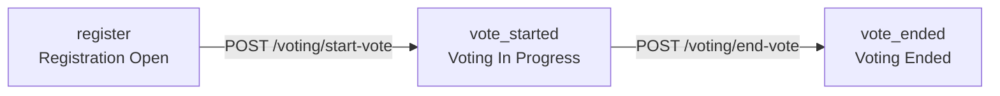

Every election in Evoting moves through three sequential phases. As the admin, you control when each transition happens using the **Vote Controls** panel in the dashboard. Voters cannot cast ballots until you start the vote, and results are not available until you end it.

## Election phases

**Registration phase — `register`**

Voters register during this phase and receive their unique N1 and N2 codes. Use this time to configure the election topic, voter limit, and candidate choices. When you are ready to open voting, click **Start Vote** in the Vote Controls panel. This is only available while the status is `register`.

**Voting phase — `vote_started`**

Voting is open. Registered voters can authenticate with their N1 code and submit their encrypted ballot. When you are satisfied that participation is complete, click **End Vote**. This is only available while the status is `vote_started`.

**Results phase — `vote_ended`**

Voting is closed. The counter decrypts all ballots and tallies the results. The **AdminResults** component appears on the dashboard showing each candidate and their vote count. Results are also publicly verifiable by voters using their N2 codes.

## Start Vote

Clicking **Start Vote** sends a POST request to `/voting/start-vote`.

- Only available when the current status is `register`
- On success, the status transitions to `vote_started`
- The dashboard React Query cache is invalidated automatically so the status badge updates immediately

## End Vote

Clicking **End Vote** sends a POST request to `/voting/end-vote`.

- Only available when the current status is `vote_started`
- On success, the status transitions to `vote_ended`
- The counter begins decrypting ballots and computing the tally
- Results become available in the **AdminResults** component

Ending the vote cannot be undone. All ballots are decrypted and finalized immediately. Verify that voting participation is complete before clicking **End Vote**.

## Viewing results

After the vote ends, the **AdminResults** component appears on the dashboard. It displays a radial bar chart of vote distribution with a color legend below, and a leaderboard sorted by vote count with a winner banner at the bottom. These results are also published publicly so voters can verify their individual ballot using their N2 code.