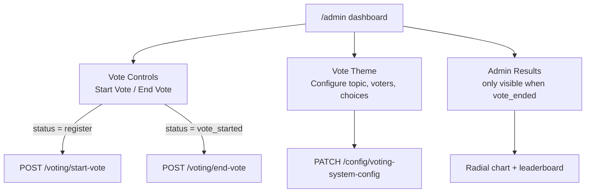

The admin dashboard at `/admin` is your central control panel for running an election. From here you configure the vote topic and candidates, transition the election through its three phases, and access the final tally once voting closes.

## Dashboard sections

The dashboard is divided into three main areas.

**Vote Controls** — buttons to start and end the vote, available only when the current phase allows that transition.

**Vote Theme** — a configuration form for the election topic, maximum voter count, and candidate choices.

**Results** — the vote tally, shown only after the election has ended.

## Status indicators

The dashboard displays a live status badge that reflects the current election phase.

| Status | Meaning |
|---|---|
| Registration Open | Voters can register. Configuration can still be changed. |
| Voting In Progress | Voting is active. No further configuration changes are possible. |
| Voting Ended | The election is closed. Results are available. |

The admin dashboard automatically refreshes the voting status after any start or end action, so you always see the current state without reloading the page.

Starting and ending the vote affects all voters immediately. These actions cannot be undone — plan your election timeline before proceeding.

## Dashboard layout

