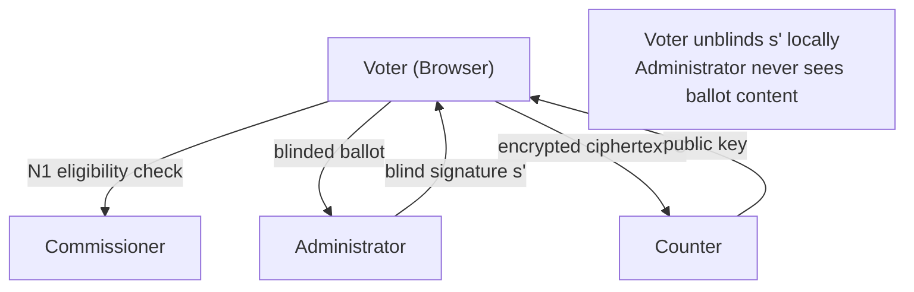
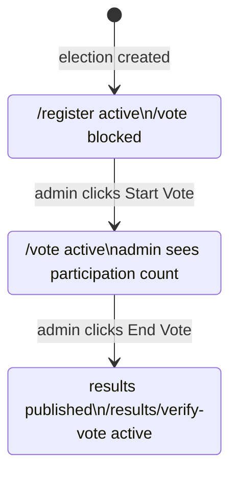
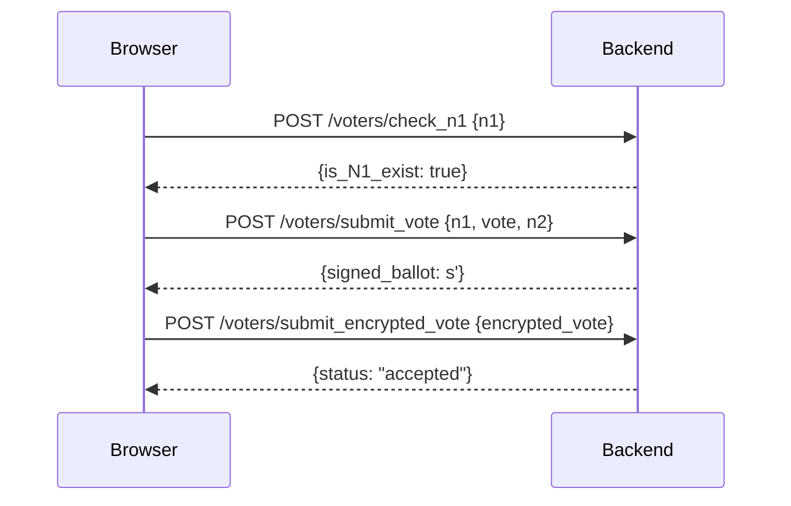

The frontend is a Next.js 15 application deployed on Vercel. It is the only surface voters and admins interact with directly. The cryptographic voting protocol is handled server-side by the backend — the browser's role is to collect voter input, communicate with the API, and display results.

## Stack

| Layer | Technology |
|---|---|
| Framework | Next.js 15, App Router |
| Language | TypeScript |
| Styling | Tailwind CSS v4 |
| Components | shadcn/ui + Radix UI |
| Server state | TanStack Query v5 |
| Client state | Zustand |
| Forms | React Hook Form + Zod |
| HTTP | Axios |
| Charts | Recharts |
| Toasts | Sonner |

---

## Four-entity trust model



| Entity | Knows | Does not know |
|---|---|---|
| Voter | Their own N1, N2, vote choice, blinding factor k | Other voters' choices |
| Administrator | Voter identity via N1/commissioner check | Vote content (blind signatures) |
| Commissioner | Valid N1 list and N2 hashes | Vote choices or ballot content |
| Counter | Decrypted vote content | Which voter cast which ballot |

---

## Frontend folder structure

```
src/
├── app/
│   ├── (voter)/          # /register, /vote, /done, /results/verify-vote
│   └── admin/            # /admin dashboard
├── components/
│   ├── Admin/            # VoteControls, ConfigEditor, AdminResults
│   ├── Vote/             # AuthStep, VoteStep, VoteStepper, VoteNotStarted, VoteEnded
│   └── ui/               # shared shadcn/ui primitives
├── hooks/                # one TanStack Query hook per API resource
├── lib/                  # Axios instance, crypto helpers
├── store/                # Zustand auth store
└── types/                # TypeScript types mirroring backend Pydantic schemas
```

---

## Election status as a state machine

The entire UI branches on one value: `voting_status`. Every page checks it and redirects if the precondition is not met.



---

## How voting works in the current implementation

The browser collects the voter's N1 and N2 codes and their candidate choice, then sends them to the backend over HTTPS. The backend handles the full cryptographic protocol — blind signing, RSA encryption, anonymization, and counting — server-side.



The blind signature protocol described in the [Cryptographic Protocol](/backend/cryptographic-protocol) page is the intended final design. In the current implementation, the backend performs the blinding, signing, and encryption operations on behalf of the voter.