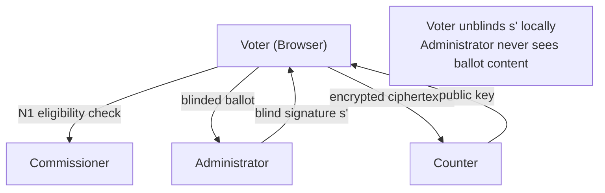
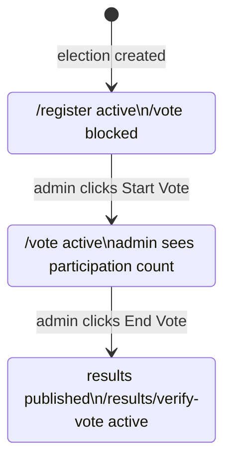
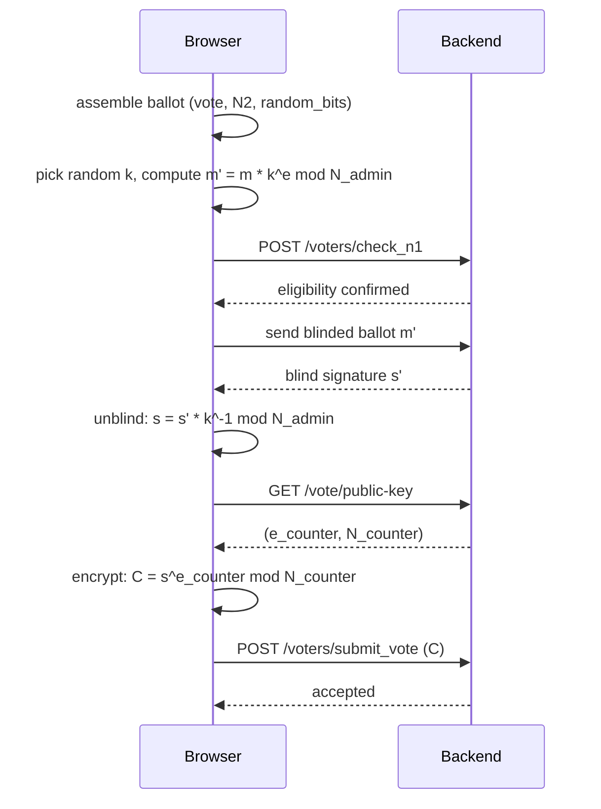

The frontend is a Next.js 16 application deployed on Vercel. It is the only surface voters and admins interact with directly. All cryptographic operations triggered by the voter — blinding a ballot, unblinding a signature, encrypting the final ciphertext — happen in the browser before anything is sent to the server.

## Stack

| Layer | Technology |
|---|---|
| Framework | Next.js 16, App Router |
| Language | TypeScript |
| Styling | Tailwind CSS v4 |
| Components | shadcn/ui + Radix UI |
| Server state | TanStack Query v5 |
| Client state | Zustand |
| Forms | React Hook Form + Zod |
| HTTP | Axios |
| Charts | Recharts |
| Toasts | Sonner |

---

## Four-entity trust model



| Entity | Knows | Does not know |
|---|---|---|
| Voter | Their own N1, N2, vote choice, blinding factor k | Other voters' choices |
| Administrator | Voter identity via N1/commissioner check | Vote content (blind signatures) |
| Commissioner | Valid N1 list and N2 hashes | Vote choices or ballot content |
| Counter | Decrypted vote content | Which voter cast which ballot |

---

## Frontend folder structure

```
src/
├── app/
│   ├── (voter)/          # /register, /vote, /done, /results/verify-vote
│   └── admin/            # /admin dashboard
├── components/
│   ├── Admin/            # VoteControls, ConfigEditor, AdminResults
│   ├── Voter/            # registration form, ballot stepper, confirmation
│   └── ui/               # shared shadcn/ui primitives
├── hooks/                # one TanStack Query hook per API resource
├── lib/                  # Axios instance, crypto helpers
├── store/                # Zustand auth store
└── types/                # TypeScript types mirroring backend Pydantic schemas
```

---

## Election status as a state machine

The entire UI branches on one value: `voting_status`. Every page checks it and redirects if the precondition is not met.



---

## Where in-browser crypto happens

The backend never sees a plaintext ballot. By the time any ballot data leaves the browser it has been blinded, signed, unblinded, and encrypted — in that order.

