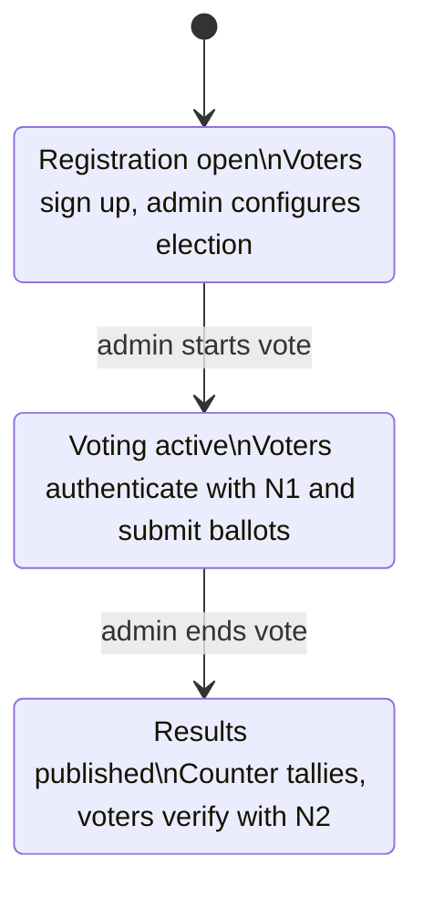

Evoting is a cryptographically secure anonymous electronic voting system built as a SaaS platform. It is designed so that every vote is counted accurately and publicly verifiable without revealing who voted for what, and without trusting any single party to run the election honestly.

## Key security properties

Evoting is built on four core security guarantees that together ensure a trustworthy election.

**Blind signatures** — the administrator signs each ballot without seeing its content, so voter privacy is preserved even during the signing step.

**End-to-end encryption** — votes are encrypted with the counter's public key before they leave the voter's browser. No one can read the ballot contents until the counter decrypts after voting ends.

**Public verifiability** — after counting, all `(N2, vote)` pairs are published. Any voter can check that their ballot was included and tallied correctly.

**Role separation** — no single entity holds enough information to alter or trace a vote. Each of the four independent entities controls only its own piece of the process.

---

## The four independent entities

| Entity | Responsibility |
|---|---|
| Voter | Registers, authenticates with N1, submits an encrypted ballot using N2 |
| Administrator | Verifies voter eligibility via the commissioner, issues blind-signed ballots, manages election phases |
| Commissioner | Holds the list of valid N1 codes, validates voter eligibility, stores N2 hashes |
| Counter | Holds the private decryption key, decrypts and tallies all ballots after voting ends |

**How N1 and N2 codes work:** When a voter registers, the system generates two unique codes. The **N1 code** is an authentication token — it proves voter eligibility and is consumed when the voter casts their ballot. The **N2 code** is a verification token — a hash of it is stored by the commissioner and is used after the election to confirm that a specific ballot was counted.

---

## Three voting lifecycle phases

Every election in Evoting moves through three sequential phases.

Phase transitions are one-way and irreversible. You cannot reopen voting after ending it, and you cannot reopen registration after starting the vote.