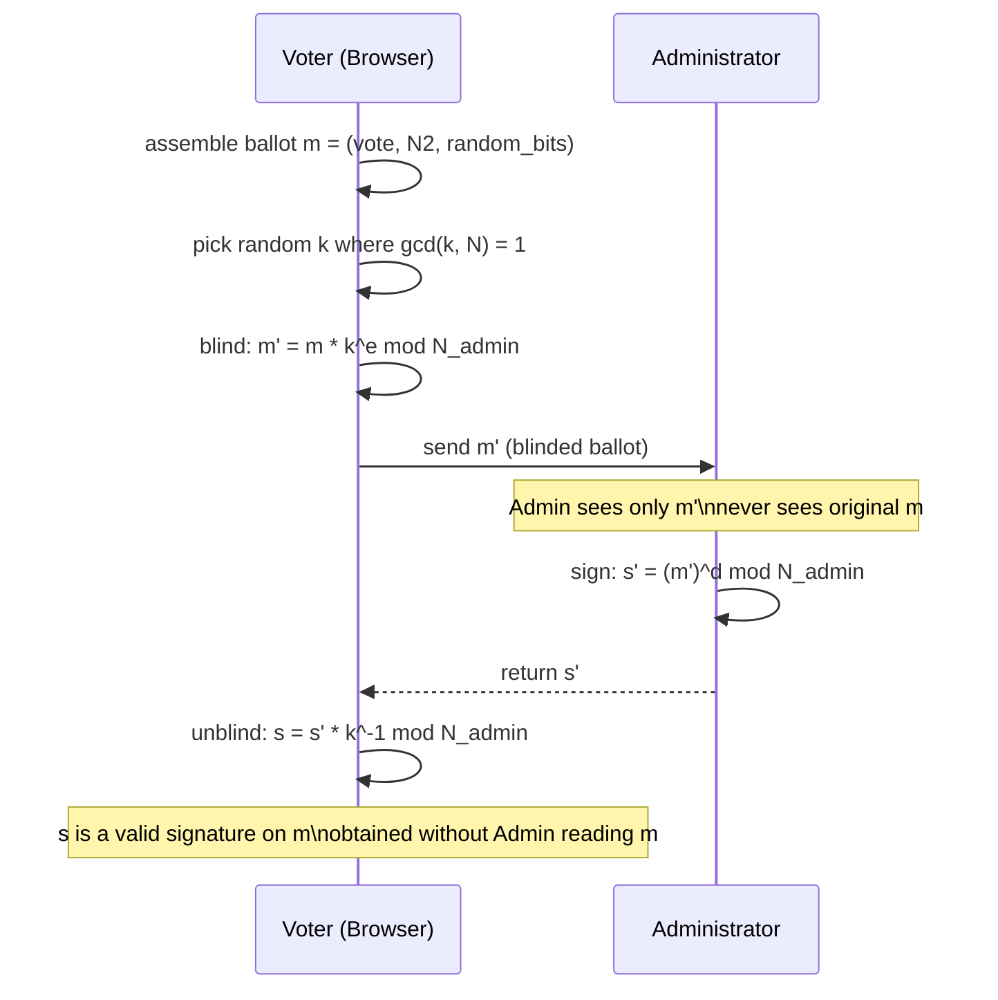

A blind signature is a cryptographic technique that allows a signer to produce a valid digital signature on a document without ever seeing its contents. Evoting uses blind signatures to solve a fundamental tension in anonymous voting: the administrator must confirm that a voter is eligible, but must not learn who that voter chose to vote for.

## Why blind signatures are necessary

The administrator's role is to verify voter eligibility. It receives a voter's N1 authentication token, checks with the commissioner that the N1 is valid, and then signs the ballot to authorize it for submission. Without blind signatures, this process would require the administrator to read the ballot — which would immediately reveal the vote choice. Blind signatures break this link: the administrator can authenticate the voter and sign the ballot in a single step, without the ballot content ever being visible to it.

## The blind signature flow

**Step 1 — Ballot creation**

The voter selects a candidate and enters their N2 verification code. These two pieces form the ballot message: a `(vote choice, N2, random_bits)` tuple that will eventually be published for public verification.

**Step 2 — Blinding**

Before the ballot is sent anywhere, the voter's client applies a blinding factor `k` — a random number chosen such that `gcd(k, N_admin) = 1`. The blinded ballot is `m' = m * k^e mod N_admin`. The blinding factor is kept secret on the voter's device and is never transmitted.

**Step 3 — Eligibility verification and signing**

The voter submits their N1 token and the blind ballot `m'` to the administrator. The administrator checks the N1 against the commissioner's list. If valid, the administrator signs: `s' = (m')^d mod N_admin` and returns `s'`. At no point does the administrator see the unblinded ballot.

**Step 4 — Unblinding**

The voter's client computes `s = s' * k^-1 mod N_admin`. The result `s` is a valid RSA signature over the original ballot `m` — the administrator certified the ballot without ever seeing it.

**Step 5 — Encryption and anonymous submission**

The unblinded signed ballot is encrypted with the counter's public key: `C = s^e_counter mod N_counter`. The encrypted ballot is then submitted through the anonymizer, which severs the link between the voter's session identity and the ballot.

## Security guarantee

After unblinding, the signed ballot carries a cryptographically valid administrator signature. During counting, the counter verifies this signature using the administrator's public key. The signature is valid precisely because the mathematical relationship between blinding, signing, and unblinding guarantees it — not because the administrator ever saw the original content.

This property is sometimes called **signer blindness**: the administrator can prove it signed a ballot in the election, but it cannot determine which candidate that ballot was for, nor can it link the signature back to the voter who submitted it.

If ballot verification during counting returns `invalid_signature`, the ballot did not pass the administrator's public key check. This indicates the ballot was either forged or tampered with after signing. A legitimate ballot that passed through the blind signature flow will always produce a valid signature.