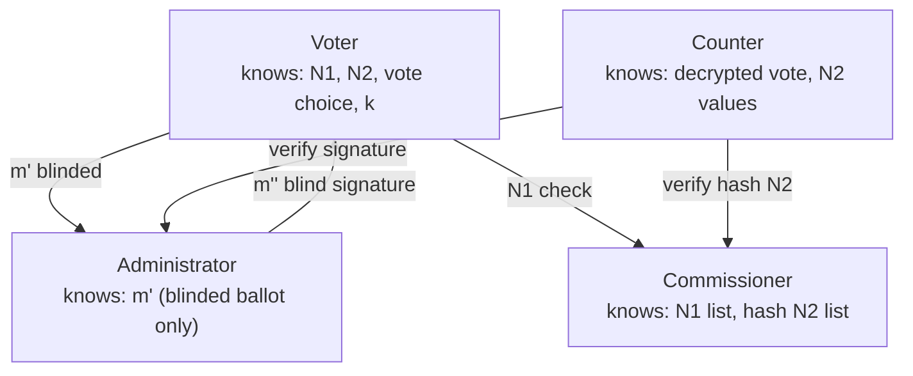

Evoting is designed so that no single party — not the administrator, the commissioner, nor the counter — can compromise an election on their own. Every vote is cryptographically protected from the moment it is cast until it is publicly verified. The system's security rests on five interlocking properties, each enforced by a distinct cryptographic mechanism.

## Security properties

**Ballot privacy**

Every ballot is encrypted with the counter's public key before it leaves the voter's browser. Only the counter, using their private key, can decrypt the ballots — and only after the voting period ends. Even the administrator and commissioner never see the plaintext vote choices stored in the system.

**Voter anonymity**

The administrator must confirm that a voter is eligible before signing their ballot, but the blind signature scheme ensures the administrator never sees the ballot content. The voter blinds their ballot before sending it for signing. After unblinding, they hold a valid administrator signature on a ballot the administrator never read. This makes it cryptographically impossible for the administrator to link a signature to a specific vote.

**Vote integrity**

During counting, the counter verifies the administrator's digital signature on every ballot. Any ballot that was tampered with after signing will fail signature verification and is rejected. This guarantees that the published results reflect only ballots that passed through the legitimate signing process.

**Prevention of double voting**

When a voter registers, the system generates a unique verification code (N2). The commissioner stores only the cryptographic hash of each N2 — not the code itself. When ballots are counted, the commissioner checks that each N2 hash appears exactly once. Because hashes are one-way functions, the original N2 cannot be reconstructed from the stored hash, and no voter can cast a second ballot with the same N2.

**Public verifiability**

After counting is complete, all valid `(N2, vote)` pairs are published. Any voter can submit their personal N2 code to the verification endpoint and confirm that their specific ballot was counted correctly — without revealing who they are or who they voted for.

## The four-entity trust model

Evoting distributes trust across four independent roles. Compromise of any one entity does not compromise the election.

| Entity | Knows | Does not know |
|---|---|---|
| Voter | Their own N1, N2, and vote choice | Other voters' choices |
| Administrator | Voter identity via N1/commissioner check | Vote content (blind signatures) |
| Commissioner | Valid N1 list and N2 hashes | Vote choices or ballot content |
| Counter | Decrypted vote content | Which voter cast which ballot |

This separation means an attacker would need to compromise multiple independent entities simultaneously to link a voter's identity to their vote or to forge a result.

## Trust boundary diagram

