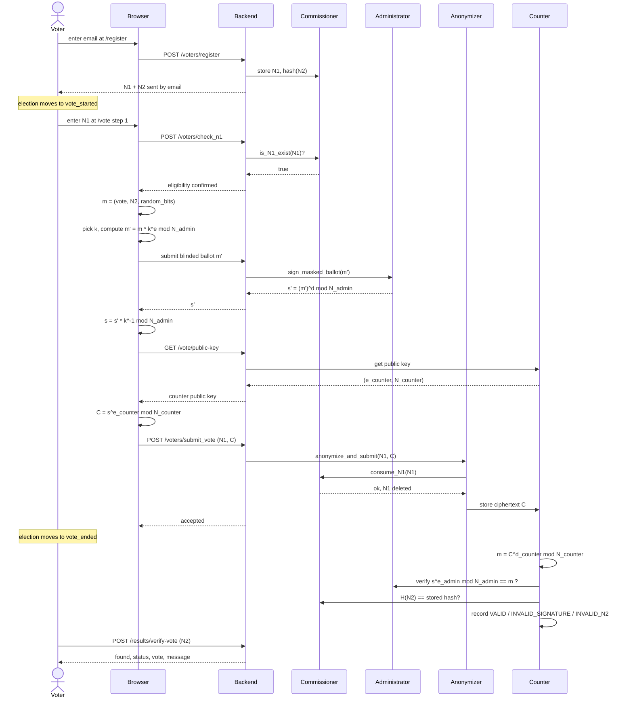
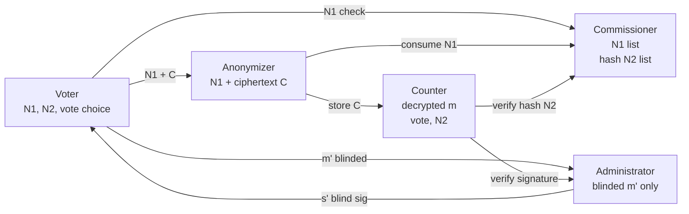

This page traces the full lifecycle of a single ballot — from the moment the voter opens the registration page to the moment they verify their ballot was counted. Each step is shown alongside which party can see what, and what happens cryptographically.

## Full end-to-end sequence

## What each party learns at each stage

| Stage | Administrator sees | Commissioner sees | Anonymizer sees | Counter sees |
|---|---|---|---|---|
| Registration | Nothing | N1, hash(N2) | Nothing | Nothing |
| N1 check | Nothing | N1 query | Nothing | Nothing |
| Ballot signing | Blinded m' only | Nothing | Nothing | Nothing |
| Vote submission | Nothing | N1 consumed | N1 + ciphertext C | Ciphertext C stored |
| Counting | Public key used | hash(N2) check | Nothing | Decrypted m, vote, N2 |

No single party ever holds voter identity and plaintext vote content at the same time.

## Information flow summary

