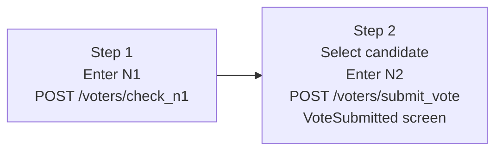

Voting in Evoting is a two-step process. All steps happen at `/vote` through a guided stepper interface.

## Prerequisites

Before you can vote, make sure:

- You have your **N1 code** and **N2 code** from the registration step. If you have not registered yet, see [Registration](/frontend/voter/registration). N2 codes are exactly 12 uppercase letters and numbers (for example, `A1B2C3D4E5F6`).
- The election is in the `vote_started` phase. If voting has not started, the `/vote` page shows a **VoteNotStarted** screen. If voting has already ended, it shows a **VoteEnded** screen.

## Voting steps

**Step 1 — Authentication**

Navigate to `/vote`. Enter your **N1 code** in the input field and submit. The system sends a request to `POST /voters/check_n1`.

- If the response contains `is_N1_exist: true`, your eligibility is confirmed and you advance to Step 2.
- If `is_N1_exist: false`, the N1 code was not recognised. Check that you copied it correctly from the registration page.

Each N1 code can only be used once to open an authenticated voting session. Do not share your N1 code with anyone.

**Step 2 — Submit your vote**

Select your preferred candidate from the list of available choices, then enter your **N2 code** in the verification field. When you click **Submit**, your ballot is sent to `POST /voters/submit_vote`. The backend handles signing and encryption on your behalf. On success, the VoteSubmitted confirmation screen is shown immediately on the same page.

## Session persistence

Your vote session is persisted in localStorage under the key `vote-session`. If you close the browser tab after completing Step 2, you can reopen `/vote` and your confirmation screen will still be shown. The session stores your current step, your N1 value, and navigation helpers.

## Security model

The cryptographic protocol — blind signing, RSA encryption, and anonymization — is handled server-side by the backend. Your N1 code proves you are eligible to vote. Your N2 code is embedded in your ballot and is how you verify your vote was counted after the election ends. Keep your N2 code safe.

## If voting is unavailable

| Election status | Screen shown | What to do |
|---|---|---|
| `register` | VoteNotStarted | Wait for the administrator to start the vote. |
| `vote_ended` | VoteEnded | Voting is closed. You can still [verify your ballot](/frontend/voter/verifying-your-vote). |