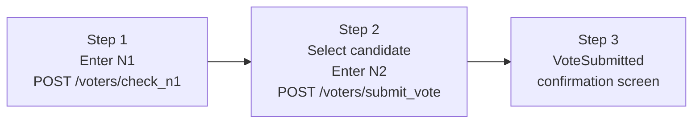

Voting in Evoting is a three-step process designed to confirm your eligibility, protect your anonymity, and give you a receipt you can use to verify your ballot later. All steps happen at `/vote` through a guided stepper interface.

## Prerequisites

Before you can vote, make sure:

- You have your **N1 code** and **N2 code** from the registration step. If you have not registered yet, see [Registration](/frontend/voter/registration). N2 codes are exactly 12 uppercase letters and numbers (for example, `A1B2C3D4E5F6`).
- The election is in the `vote_started` phase. If voting has not started, the `/vote` page shows a **VoteNotStarted** screen. If voting has already ended, it shows a **VoteEnded** screen.

## Voting steps

**Step 1 — Authentication**

Navigate to `/vote`. Enter your **N1 code** in the input field and submit. The system sends a request to `POST /voters/check_n1`.

- If the response contains `is_N1_exist: true`, your eligibility is confirmed and you advance to Step 2.
- If `is_N1_exist: false`, the N1 code was not recognised. Check that you copied it correctly from the registration page.

Each N1 code can only be used once to open an authenticated voting session. Do not share your N1 code with anyone.

**Step 2 — Submit your vote**

Select your preferred candidate from the list of available choices, then enter your **N2 code** in the verification field. When you click **Submit**, your ballot is blind-signed and encrypted before it is sent to `POST /voters/submit_vote`. This means the server signs your ballot without learning which candidate you chose — only the encrypted ballot reaches the administrator. On success, you advance to Step 3.

**Step 3 — Confirmation**

The confirmation screen (VoteSubmitted) appears to let you know your ballot was received. Your voting session is saved in localStorage so you can return to this screen if you accidentally close the tab. Your N2 code is what you will use later to verify your ballot was counted. Keep it safe.

## Session persistence

Your vote session is persisted in localStorage under the key `vote-session`. If you close the browser tab after completing Step 3, you can reopen `/vote` and your confirmation screen will still be shown. The session stores your current step, your N1 value, and navigation helpers.

## Security model

Your vote content is hidden from the election administrator through **blind signatures**. When you submit your ballot, the system encrypts your vote and has it signed in a way that the signer cannot read the content. Only the encrypted, signed ballot is transmitted.

## If voting is unavailable

| Election status | Screen shown | What to do |
|---|---|---|
| `register` | VoteNotStarted | Wait for the administrator to start the vote. |
| `vote_ended` | VoteEnded | Voting is closed. You can still [verify your ballot](/frontend/voter/verifying-your-vote). |