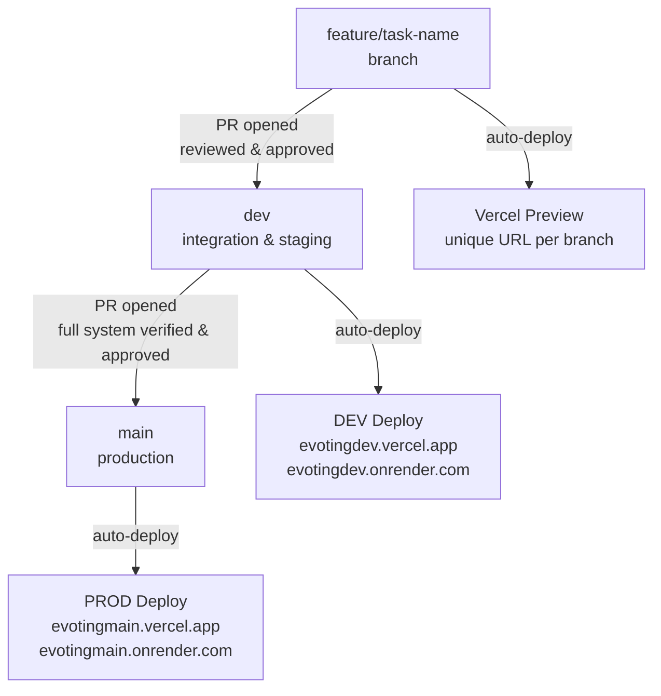

CryptoVote lives in a dedicated GitHub organization. All source code, branch protection rules, and team permissions are managed here.

## Organization

The GitHub organization is **`secure-evoting`**. Using an org instead of personal repositories gives the team shared ownership, centralized permission management, and repository-level branch protection that cannot be bypassed by any individual member.

Two repositories live under the org:

| Repository | Stack | Purpose |
|---|---|---|
| `evoting-backend` | FastAPI / Python 3.11 | All backend services, crypto modules, database models, migrations |
| `evoting-frontend` | React / Next.js | All UI components, pages, API integration layer |

---

## Branch Structure

| Branch | Purpose | Protection |
|---|---|---|
| `main` | Production (what is live) | Protected; PR required, Akram or Walid only |
| `dev` | Staging / integration | Protected; PR required, Akram or Walid only |
| `feature/*` | All active development | No protection; deleted after merge |
| `bugfix/*` | Bug fixes | No protection; deleted after merge |

<Warning>
Direct pushes to `dev` and `main` are blocked at the **repository level** in GitHub settings, not just by team agreement. No developer can bypass this, regardless of their local setup.
</Warning>

---

## Branch Naming

Branch names come directly from Jira task titles. Branches are created from Jira. never manually from the terminal. The task title becomes the branch name automatically.

```bash
feature/<jira-task-title>
bugfix/<jira-task-title>

# Examples
feature/database-models-repositories
feature/rsa-utils-blindsignature
bugfix/cors-missing-origin-header
```

<Warning>
Always branch from `dev`, never from `main`. Branching from `main` causes merge conflicts and broken state when merging back.
</Warning>

---

## Branch Protection Rules

Both `main` and `dev` have the following rules enforced in GitHub settings:

- Direct pushes are blocked , a pull request is required for every merge
- At least **1 approved review** is required before merge
- Only **Akram** and **Walid** have merge permissions


<Note>
The screenshot above shows the branch protection configuration in the GitHub repository settings. If you need to verify or update these rules, navigate to **Settings → Branches** in either repository.
</Note>

---

## Pull Request Flow

Every change follows this exact path from feature branch to production:



---

## Pull Request Rules

Every PR must satisfy all of the following before it can be merged:

- At least **1 reviewer** assigned (Akram or Walid)
- PR description includes: what was done, what was tested, any environment variable changes
- PR description references the **Jira task ID**
- No failing tests
- No unresolved review comments
- Jira task moved to **TESTING** state before the PR is opened

<Warning>
No PR is merged without Akram's or Walid's explicit approval. Merging without authorization is a zero-tolerance violation.
</Warning>

---

## Commit Message Format

```bash
<type>(<scope>): <short description>

# Types
feat | fix | test | docs | refactor | chore

# Scopes
backend | frontend | crypto | db | api

# Examples
feat(crypto): implement blind signature unmasking
fix(db): add check_same_thread for SQLite engine
test(api): add end-to-end vote submission test
docs(infra): update render environment variables
```

---

## Preview Deployments

Every push to a `feature/*` branch triggers an automatic Vercel preview deployment with a unique URL. Preview deployments are temporary, they are deleted when the branch is deleted.


<Warning>
Preview deployments **must be verified** before opening a PR to `dev`. Do not open a PR against a preview you have not tested.
</Warning>

---

