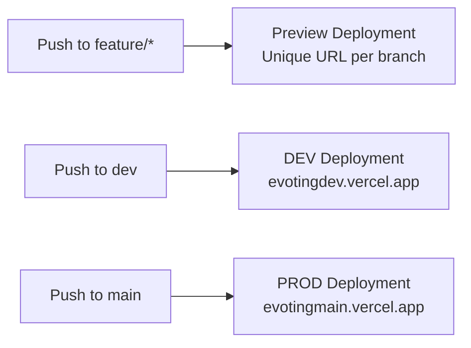

Vercel hosts the React/Next.js frontend. It is connected directly to the `evoting-frontend` GitHub repository and deploys automatically on every push no manual deployment steps required.

---

## Two Deployed Services

| Service | Connected Branch | URL | Purpose |
|---|---|---|---|
| **DEV** | `dev` | `https://evotingdev.vercel.app` | Staging, integration testing |
| **PROD** | `main` | `https://evotingmain.vercel.app` | Live production |

Each service is fully isolated , separate build contexts, separate environment variables, separate deployment history.

---

## Automatic Deployments

Vercel watches the GitHub repository and reacts to every push:



There is no build command to run manually. The moment a PR is merged, Vercel picks it up.

---

## Preview Deployments

Every `feature/*` branch gets its own live preview URL automatically generated by Vercel. This URL is posted directly inside the GitHub pull request as a deployment check.

<Warning>
Preview deployments **must be tested** before opening a PR to `dev`. Do not open a PR on an untested preview.
</Warning>

Preview deployments are **temporary** , they are deleted automatically when the branch is deleted after merge.

---

## Environment Variables

Each service has its own isolated environment variables configured in the Vercel dashboard. They are never shared between DEV and PROD.

| Variable | DEV Value | PROD Value |
|---|---|---|
| `VITE_API_URL` | `https://evotingdev.onrender.com` | `https://evotingmain.onrender.com` |

<Warning>
`VITE_API_URL` must point to the correct Render backend for each environment. A wrong value means the frontend silently calls the wrong backend , DEV frontend hitting PROD data, or vice versa.
</Warning>

Environment variables are set in the **Vercel dashboard** under each service's settings. They are never stored in files committed to the repository.


---

## Local Environment File

The local frontend uses a `.env.local` file at the project root. This file is never committed.

```bash
# .env.local , local development only
VITE_API_URL=https://evotingdev.onrender.com
```

<Note>
The local frontend always points to the **DEV backend** on Render , not to a local backend , unless you are explicitly testing a local backend integration. This ensures the local environment behaves as close to DEV as possible.
</Note>

---

## Free Tier Considerations

Vercel's free tier imposes build minute limits. Hitting the limit blocks all deployments until the billing cycle resets.

<Warning>
Do not push multiple small commits in quick succession. Every push to `dev` or `main` triggers a full rebuild. Batch your changes into a single meaningful push.
</Warning>

Best practices to stay within limits:

- Use **PR preview deployments** for review and testing , not repeated pushes to `dev`
- Resolve all issues on your `feature/*` branch before merging
- Never push directly to `dev` or `main` to "test a quick fix"

---

## Images Required

| Filename | Content |
|---|---|
| `/images/vercel-preview-pr.png` | GitHub PR view showing the Vercel preview deployment check with the unique preview URL |
| `/images/vercel-env-vars.png` | Vercel dashboard → Project Settings → Environment Variables panel showing the DEV and PROD services |