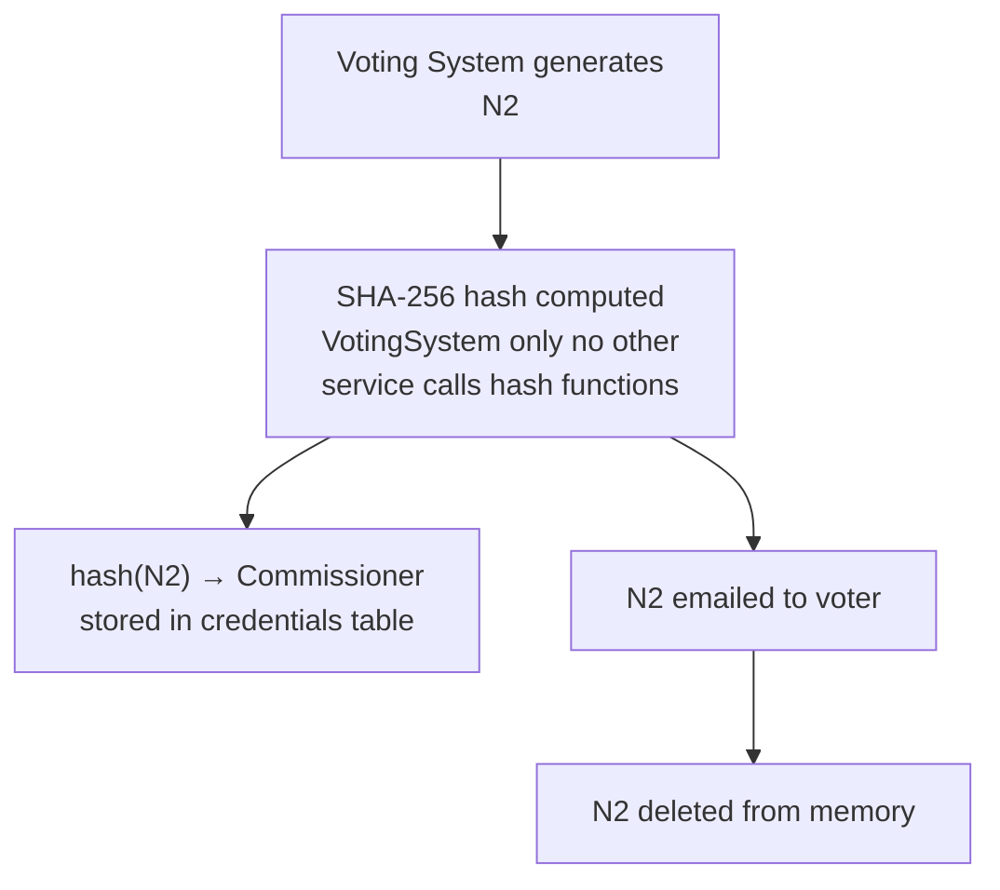

CryptoVote is built around one core principle: **no single entity in the system has enough information to compromise the election alone.** Power is deliberately distributed across five isolated roles. Each role sees only what it strictly needs. No role can forge a vote, reveal a voter's identity, or corrupt the tally, even if it tries.

---

## The Five Roles

The system is structured around five logical entities. Each has a clearly scoped view of the election data. Their intentional ignorance of each other's secrets is what makes the system secure.

| Role | Knows | Cannot Know | Cannot Do |
|---|---|---|---|
| **Voting System** | Voter identities, N1, N2 (temporarily) | How anyone voted | Sign ballots, count votes |
| **Commissioner** | Valid N1 codes, hash(N2) list | N2 in plaintext, vote content | Forge valid votes, see ballots |
| **Administrator** | Valid N1 codes (via Commissioner) | N2, vote content (masked) | Link a ballot to a voter |
| **Anonymizer** | N1 at submission time | N2, vote content (encrypted) | Decrypt ballots, link votes to voters |
| **Counter** | Decrypted ballots, N2 (at counting time) | Voter identity | Generate valid new votes (election is closed) |

<Warning>
Services communicate via **direct Python function calls only**. There is no HTTP between services. This is not a convenience , it is a security boundary that prevents lateral injection attacks between service layers.
</Warning>

---

## Security Guarantees

| Property | Mechanism |
|---|---|
| **Anonymity** | Blind signature prevents Administrator from seeing ballot content. Random bits in ballot prevent post-election linkage. |
| **Integrity** | RSA-PSS signature on every ballot. Invalid signatures are rejected at count time. |
| **Authenticity** | Only ballots signed by the Administrator's private key are accepted. |
| **No double voting** | N1 is atomically invalidated by the Commissioner on first use. A second submission with the same N1 fails. |
| **No double counting** | `hash_n2` carries a `UNIQUE` constraint in `counted_votes`. A second ballot with the same N2 is rejected at the database level. |
| **Verifiability** | After counting, the public list of (N2, vote) pairs lets each voter confirm their own ballot was counted. |

---

## Why N2 Is Never Stored in Plaintext

N2 is the voter's private proof that their vote was cast. If N2 were stored in plaintext anywhere in the system:

- The Commissioner could reconstruct valid ballots.
- A database leak would expose which voters' ballots were included.

**The protection chain:**


Only the voter ever holds N2 in plaintext. The Commissioner holds only its SHA-256 fingerprint. At counting time, the Counter sends N2 to the Voting System, which hashes it and returns `hash(N2)` , the Counter never calls hash functions directly.

<Warning>
**Storing N2 in plaintext in any database table is a zero-tolerance security breach.** It violates the protocol and exposes voters to deanonymization.
</Warning>

---

## The N1 / N2 Lifecycle

N1 and N2 are two independent proofs that together authorize a single valid vote.

**N1** proves the voter's right to vote. It is single-use and known to the Commissioner.

**N2** proves the ballot's authenticity at count time. It is private to the voter and known to the system only as `hash(N2)`.

```
INITIALIZATION
──────────────
Voting System generates N1 + N2 (12-char alphanumeric, ~10¹⁸ combinations each)
→ hash(N2) computed and sent to Commissioner
→ N1 + hash(N2) stored in credentials table
→ N1 + N2 emailed to voter
→ N2 deleted from memory

VOTING
──────
Voter submits N1 → Administrator validates via Commissioner
Voter constructs ballot: { vote, N2, random_bits }
Voter blinds ballot → Administrator signs blindly → Voter unblinds
Voter submits { N1, encrypt(ballot, counter_public_key) } to Anonymizer
Anonymizer validates N1 → Commissioner atomically sets used = True
Anonymizer stores encrypted ballot (no identity link)

COUNTING
────────
Counter decrypts all ballots with private key
Counter verifies Administrator's RSA-PSS signature on each ballot
Counter extracts N2 → sends to Voting System → receives hash(N2)
Counter sends hash(N2) to Commissioner → validates against credentials
Counter inserts { hash(N2), vote } into counted_votes (UNIQUE enforced)
Counter aggregates results

VERIFICATION
────────────
Voter submits N2 to Voting System
Voting System computes hash(N2), checks counted_votes
Returns: found / not found
```

---

## Why Each Entity Cannot Compromise the Election

### Commissioner
Holds N1 list and hash(N2) list. Never has direct contact with the voter or the ballot. Cannot generate valid votes because N2 is only known through its hash the preimage resistance of SHA-256 makes reconstruction computationally infeasible.

### Administrator
Sees valid N1 codes (via Commissioner validation). Has no access to N2. Signs ballots blindly the masking factor `k` prevents the Administrator from ever seeing the ballot content being signed. Cannot link a signed ballot back to a voter after the fact.

### Anonymizer
Knows N1 at submission time. Does not know N2. Receives ballots encrypted under the Counter's public key the content is opaque. Even after (N2, vote) pairs are published post-election, the Anonymizer cannot correlate them to encrypted submissions because the random bits added to form the ballot break that link.

### Counter
Decrypts ballots and knows vote content and N2 at counting time. Cannot link votes to voters the Anonymizer broke that link during submission. Could theoretically alter vote choices, but the voting period has closed and the Administrator signs no more ballots, so the Counter cannot generate a new valid ballot to substitute.

---

## Attack Prevention

| Attack | Prevention |
|---|---|
| **Vote forgery** | Only ballots with a valid Administrator RSA-PSS signature are accepted. |
| **Ballot duplication** | `UNIQUE` constraint on `hash_n2` in `counted_votes` rejects duplicate N2 at the database level. |
| **Ballot tampering** | RSA-PSS signature verification detects any modification to the ballot content. |
| **Replay attack** | N1 is atomically invalidated on first use. Replaying the same N1 fails Commissioner validation. |
| **Unauthorized submission** | Anonymizer validates N1 before recording any ballot. Invalid N1 → submission rejected. |
| **Voter deanonymization** | Random bits in ballot + blind signature + encryption under Counter key creates three independent unlinkability layers. |
| **Ballot box stuffing** | Commissioner holds hash(N2) list, not N2 , cannot generate valid new ballots. Administrator holds no N2 , same constraint. |

---

## The "No Single Entity" Principle

No single role can compromise the system unilaterally:

- **Commissioner alone** → cannot forge ballots (no N2 plaintext, no signing key).
- **Administrator alone** → cannot forge ballots (no N2, cannot see ballot content through blind signature).
- **Anonymizer alone** → cannot forge ballots (no N2, cannot decrypt ballots).
- **Counter alone** → cannot forge ballots (election closed, Administrator signs no more).
- **Voting System alone** → cannot cast or alter votes (no signing key, no ballot box access).

A successful attack requires collusion between multiple entities a much higher bar than compromising a single centralized system.

---

