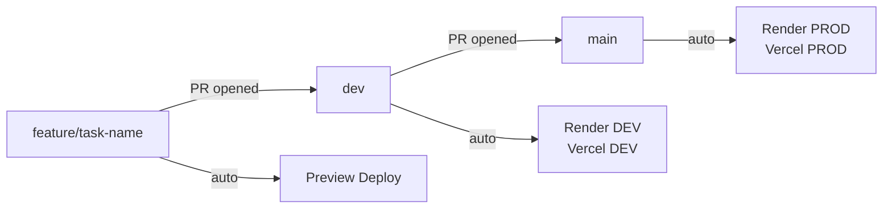

This is a rulebook, not a guide. Every rule on this page is mandatory. Violations will break the system, corrupt data, or block the entire team.

---

## 1. Environment Configuration

Each environment has exactly one configuration source. There are no exceptions to this mapping.

| Environment | Database | Configuration source |
|---|---|---|
| Local | SQLite | `.env.local` on each developer's machine |
| DEV | Neon DEV | Render DEV service environment variables |
| PROD | Neon PROD | Render PROD service environment variables |

**`.env.example`** is a read-only placeholder committed to the repository. It shows variable names only and contains no real values. Never add credentials to it, never rename it, never copy from it into deployment configs.

**`.env.local`** is the only local environment file. It is listed in `.gitignore` and is never committed. Every team member creates their own by copying the structure from `.env.example` and filling in real values.

<Warning>
Committing `.env.local` to the repository exposes all secrets to the entire team and anyone with repository access. This is a zero-tolerance violation.
</Warning>

The local frontend always points to the DEV backend. There is no `.env.dev` or `.env.prod` locally.

```bash
# .env.local (frontend)
VITE_API_URL=https://evoting-dev.onrender.com
```

```bash
# .env.local (backend)
DATABASE_URL=sqlite:///./local.db
SECRET_KEY=local-secret
ALLOWED_ORIGINS=http://localhost:5173
```

---

## 2. Database Rules

**SQLite is strictly forbidden on any deployed environment.** It is used for local development and unit testing only. Neon DEV is for integration testing. Neon PROD is for production only and is never touched during development.

The SQLAlchemy engine must be configured conditionally based on `DATABASE_URL`. The database type is never hardcoded.

```python
if DATABASE_URL.startswith("sqlite"):
    engine = create_engine(DATABASE_URL, connect_args={"check_same_thread": False})
else:
    engine = create_engine(DATABASE_URL)
```

`DATABASE_URL` is the single source of truth for the database connection. It is always read from the environment variable. It is never hardcoded in service or model code.

`ALLOWED_ORIGINS` must match the frontend URL for that environment exactly. Wildcards are forbidden in production. A wrong `ALLOWED_ORIGINS` value means the frontend cannot reach the API at all.

---

## 3. Alembic Migrations

No database schema change is allowed without a migration file. This rule has no exceptions. Adding a column, renaming a table, changing a type, adding a constraint — all of these require a migration.

**Sophia owns all migration files.** No one else generates or modifies them without her approval.

The correct workflow for any schema change:

```bash
# 1. After changing a SQLAlchemy model, generate the migration
alembic revision --autogenerate -m "describe what changed"

# 2. Review the generated file in alembic/versions/
# Verify it matches your intent before applying

# 3. Apply the migration locally
alembic upgrade head

# 4. Commit the migration file and the model change in the same commit
```

On Render, migrations run automatically on every deploy via the startup command:

```bash
alembic upgrade head && uvicorn main:app --host 0.0.0.0 --port $PORT
```

<Warning>
Never edit an already-applied migration file. Never delete a migration file. Never run `ALTER TABLE` or `CREATE TABLE` manually on any deployed database. All of these corrupt migration history and break schema synchronization across environments.
</Warning>

---

## 4. Backend Development Rules

Render is not a development environment. All backend logic is developed and tested locally using SQLite. Render DEV is used only for integration testing with the frontend and for final verification before merging to `main`.

| Scenario | Environment |
|---|---|
| Developing backend logic | Local (SQLite) |
| Unit testing services and crypto | Local (SQLite) |
| Testing frontend and backend integration | Render DEV |
| Final verification before merging | Render DEV |
| Production traffic | Render PROD |

Render's free tier spins down services after inactivity. The first request after a cold start may take 20 to 30 seconds. Do not spam requests to wake the service. Use your local backend during development.

All database access goes through the repository layer. No service or route accesses the database directly.

---

## 5. Git Workflow



Branch rules with no exceptions:

- Always create feature branches from `dev`, never from `main`
- Never push directly to `dev` or `main`
- Every merge requires a pull request
- Only Akram and Walid can approve and merge PRs
- Feature branches are deleted after merge
- Branch names must match the Jira task title exactly

**Commit message format:**

```
<type>(<scope>): <short description>

type:  feat | fix | test | docs | refactor | chore
scope: backend | frontend | crypto | db | api
```

Examples:

```
feat(crypto): implement blind signature unmasking
fix(db): add check_same_thread for SQLite engine
test(api): add end-to-end vote submission test
docs(infra): add Render environment variable reference
```

Every PR must include what was done, what was tested, and any environment variable changes. No PR is merged with failing tests or unresolved review comments. The Jira task ID must be referenced in the PR description.

---

## 6. Deployment Rules

**Vercel (frontend)**

| Git event | Result |
|---|---|
| Push to `dev` | Deploy to DEV frontend |
| Push to `main` | Deploy to PROD frontend |
| Push to `feature/*` | Preview deployment only |

Every feature branch gets its own preview URL automatically. Preview deployments must be verified before opening a PR to `dev`. Avoid pushing multiple small commits since every push triggers a build.

**Render (backend)**

| Service | Branch | Database |
|---|---|---|
| `evoting-dev` | `dev` | Neon DEV |
| `evoting-main` | `main` | Neon PROD |

Each service has its own isolated environment variables set in the Render dashboard. DEV and PROD environment variables are never shared.

---

## 7. Crypto Module Rules

All cryptographic logic lives in `app/crypto/`. No other module imports cryptography libraries directly. During local development, `print()` statements and logging calls are permitted for inspecting intermediate values.

<Warning>
Before pushing any branch, every `print()` statement and every debug logging call inside `app/crypto/` must be removed. This applies to `rsa_utils.py`, `blind_signature.py`, `hash_utils.py`, and `key_manager.py`. A PR with debug output in crypto modules will be rejected.
</Warning>

Calling hash functions from any service other than `voting_system_service` is a protocol violation. N2 must never be stored in plaintext in any database table under any circumstances.

---

## 8. Free Tier Management

**Vercel:** batch changes into a single meaningful push. Do not push multiple small commits in quick succession. Use PR preview deployments for review instead of repeatedly pushing to `dev`.

**Render:** do not spam requests to wake a sleeping service. Use your local backend during development. If Render limits are reached, GitHub Actions is the fallback CI/CD option.

**Neon:** do not run load tests or bulk inserts against Neon DEV or PROD. DEV and PROD databases are never mixed. No developer has direct access to the PROD database during development.

---

## 9. Forbidden Violations

These are zero-tolerance violations. Each one will either break the system, corrupt data, or expose credentials.

| Violation | Consequence |
|---|---|
| SQLite used on Render DEV or PROD | Data loss, broken deployment |
| Wrong `VITE_API_URL` in frontend | Frontend calls wrong backend |
| Missing `DATABASE_URL` on Render | Application crash on startup |
| CORS misconfiguration | Frontend blocked from all API calls |
| Mixing DEV and PROD databases | Data corruption |
| Pushing directly to `dev` or `main` | Bypasses review, immediate revert required |
| Creating a branch from `main` | Merge conflicts and broken state |
| Merging a PR without Akram or Walid approval | Unauthorized code in integration branch |
| Calling hash functions outside `voting_system_service` | Protocol violation |
| Storing N2 in plaintext in any database table | Security breach |
| Hardcoding `DATABASE_URL` in source code | Credential leak |
| Using `*` as `ALLOWED_ORIGINS` in production | Security breach |
| Schema change without an Alembic migration file | Database out of sync across environments |
| Manually running `ALTER TABLE` or `CREATE TABLE` on any deployed DB | Untracked schema change, breaks migrations |
| Editing or deleting an already-applied migration file | Migration history corrupted |
| Leaving `print()` or debug logs in crypto modules before pushing | PR rejected |
| Committing `.env.local` | Credential leak, all secrets exposed |
| Editing `.env.example` with real values | Credential leak, visible to entire team |

---

## 10. Pre-Push Checklist

Run through this checklist before pushing any branch.

**Backend**

<Steps>
  <Step title="Environment">
    Code runs locally with `.env.local` and SQLite. No hardcoded URLs, keys, or database strings anywhere.
  </Step>
  <Step title="Database">
    `DATABASE_URL` is read from environment only. SQLAlchemy engine uses the conditional `check_same_thread` setup. If a model was changed, an Alembic migration file exists and is committed in the same branch. Migration applied locally with `alembic upgrade head` and tested before push.
  </Step>
  <Step title="Code quality">
    No `print()` or debug statements left anywhere in `app/crypto/`. All new endpoints tested locally with correct HTTP method and body.
  </Step>
  <Step title="Branch">
    Branch created from `dev`, not from `main`. Branch name matches the Jira task title exactly. No direct push to `dev` or `main`.
  </Step>
</Steps>

**Frontend**

<Steps>
  <Step title="Environment">
    `.env.local` has `VITE_API_URL=https://evoting-dev.onrender.com`. No hardcoded API URLs in any component or service file.
  </Step>
  <Step title="Code quality">
    All API calls go through `api.js`. No inline `fetch()` in components. No `console.log()` left in production-bound code.
  </Step>
  <Step title="Preview">
    Preview deployment tested before opening PR.
  </Step>
  <Step title="Branch">
    Branch created from `dev`, not from `main`. Branch name matches the Jira task title exactly.
  </Step>
</Steps>

**Before opening any PR**

<Steps>
  <Step title="PR description">
    References the Jira task ID. Describes what was done, what was tested, and any environment variable changes.
  </Step>
  <Step title="Review">
    At least one reviewer assigned (Akram or Walid). No merge conflicts with `dev`.
  </Step>
  <Step title="Code">
    No temporary or commented-out code blocks left in the branch.
  </Step>
  <Step title="Jira">
    Task moved to TESTING before the PR is opened.
  </Step>
</Steps>

---

<Card title="Team Roles" icon="users" href="/team/roles">
  Module ownership, responsibilities, and the permission matrix.
</Card>