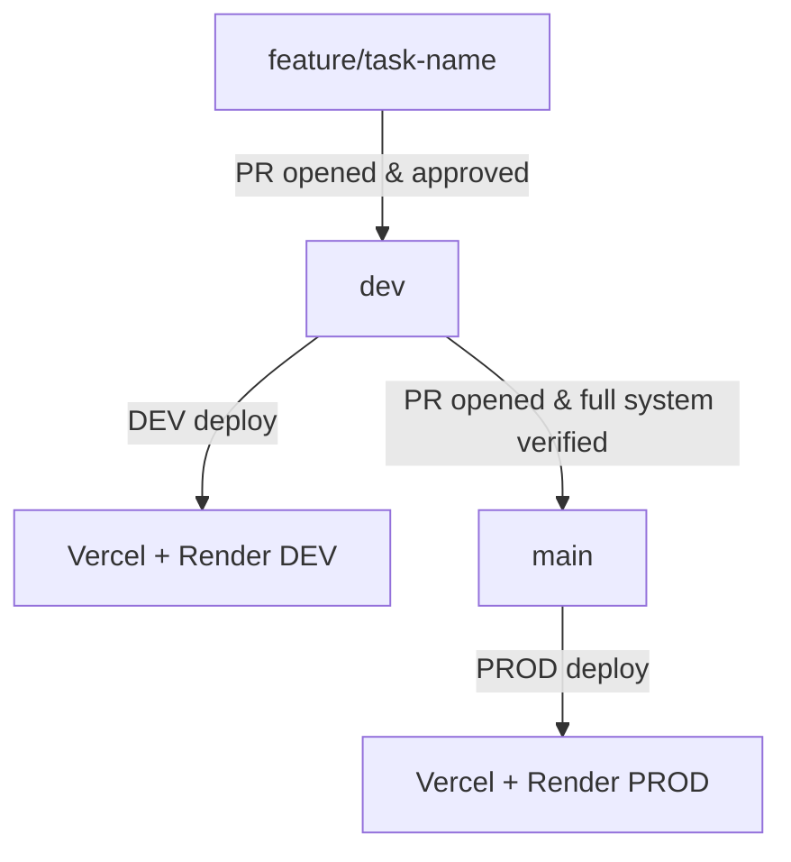

All development follows a strict Git workflow. Every rule here is mandatory.

---

## Branch Structure

| Branch | Purpose | Protection |
|---|---|---|
| `main` | Live production | Akram or Walid only |
| `dev` | Staging and integration | PR required |
| `feature/*` | All active development | Deleted after merge |
| `bugfix/*` | Bug fixes | Deleted after merge |

---

## The Flow



---

## Branch Rules

<Warning>Never push directly to `dev` or `main`. Every change goes through a Pull Request.</Warning>

- Always branch from `dev` — never from `main`
- Branch names come directly from the Jira task title
- Feature branches are deleted after merge

```
feature/<jira-task-title>
bugfix/<jira-task-title>
```

```
feature/database-models-repositories
feature/rsa-utils-blind-signature
bugfix/cors-allowed-origins
```

---

## Pull Request Rules

- Every PR requires at least 1 approved review before merge
- Only **Akram** and **Walid** can approve and merge
- PR description must reference the Jira task ID
- No PR is merged with failing tests or unresolved comments

---

## Commit Format

```
<type>(<scope>): <short description>
```

| Type | When |
|---|---|
| `feat` | New feature |
| `fix` | Bug fix |
| `test` | Tests |
| `docs` | Documentation |
| `refactor` | Code restructure |
| `chore` | Config, dependencies |

Scopes: `backend` · `frontend` · `crypto` · `db` · `api`

```
feat(crypto): implement blind signature unmasking
fix(db): add check_same_thread for SQLite engine
docs(infra): update Render environment variable table
```

---

## Permissions

| Action | Akram | Walid | Sophia | Amal | Maylis |
|---|---|---|---|---|---|
| Push to `feature/*` | Yes | Yes | Yes | Yes | Yes |
| Open a PR | Yes | Yes | Yes | Yes | Yes |
| Review a PR | Yes | Yes | Yes | Yes | Yes |
| Merge PR to `dev` | Yes | Yes | No | No | No |
| Merge `dev` to `main` | Yes | Yes | No | No | No |

---

## Pre-Push Checklist

**Backend**
- [ ] Runs locally with `.env.local`
- [ ] No `print()` or debug statements
- [ ] No hardcoded URLs or secrets
- [ ] Alembic migration committed if model changed
- [ ] `alembic upgrade head` applied locally

**Frontend**
- [ ] `VITE_API_URL` set to DEV backend in `.env.local`
- [ ] All API calls go through `api.js`
- [ ] No `console.log()` left in code
- [ ] Preview deployment tested

**Before any PR**
- [ ] Jira task ID in PR description
- [ ] Reviewer assigned
- [ ] No merge conflicts with `dev`
- [ ] Jira task moved to **TESTING**